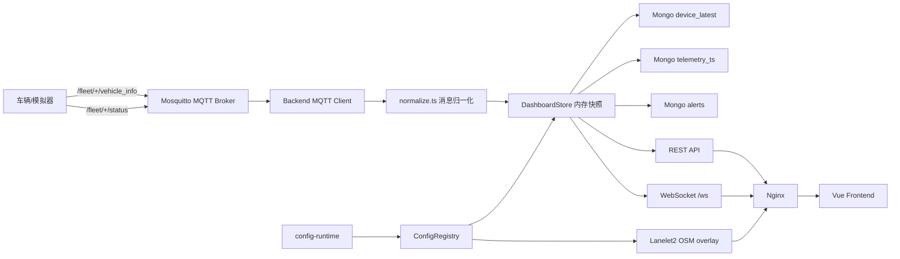

# NavFleet 项目架构说明

## 1. 项目定位

NavFleet（智能车队监控平台）是一个面向 AGV、巡检车、无人搬运车等设备的实时运行态监控系统。系统目标是把设备接入、实时展示、历史追踪、地图资源和运行配置统一到一套可部署、可维护的工程中。

系统提供：

- MQTT 设备接入。
- 车辆实时状态归一化。
- 最新快照和历史遥测存储。
- WebSocket 实时推送。
- 车辆、编队、告警、GPS 地图、场景地图和点云地图展示。
- Lanelet2 OSM 文件服务端解析。
- Docker Compose 一键部署。

## 2. 技术栈

### 前端

两套控制台并存，见第 6 节。默认部署的是 v3（`frontend-next/`）：

- Vue 3（`<script setup lang="ts">`，全量 TypeScript）
- Vite
- vue-router（**web history**）+ Pinia（状态库）
- Tailwind v4（明暗双主题，CSS 变量令牌 + `data-theme`）+ Reka UI（无样式可访问组件）
- ECharts（懒加载，只有「曲线 / 历史回放」两个 tab 会取）
- 高德地图 JS API，需要配置浏览器 Key
- 自定义点云、场景地图和路网渲染逻辑
- Vitest 单元测试

保留作回滚的 v1.0.0（`frontend/`）差别在：vue-router **hash 路由**、原生 CSS、渐进式
TypeScript 迁移、无 ECharts。

### 后端

- Node.js **>= 22**（根 `package.json` 的 `engines`；CI 在 22 与 24 上跑。node 20 已 EOL，
  矩阵在 2026-09-08 去掉了它）
- TypeScript
- Express 5
- `ws` WebSocket 服务
- `mqtt` MQTT 客户端
- `mongodb` 官方驱动
- `zod` 环境变量与入参校验（fail-fast）
- `chokidar` 监听运行期配置变化
- `pino` 日志
- `prom-client` Prometheus 指标
- `helmet` / `cors` / `express-rate-limit` / `bcrypt` / `jsonwebtoken`：安全与鉴权

### 部署组件

- Nginx：统一 HTTP 入口和反向代理
- Mosquitto：MQTT Broker
- MongoDB：最新快照、时序遥测和告警存储
- Docker Compose：单机部署编排

## 3. 总体架构



架构边界：

- 设备只需要接入 MQTT，不需要知道前端和数据库。
- 前端只访问后端，不直接连接 MQTT Broker。
- 后端负责配置合并、数据归一化、告警生成、持久化和实时推送。
- MongoDB 负责恢复和查询，不承担前端实时推送职责。
- `config-runtime/` 是运行时配置源，镜像构建物不包含业务配置的最终版本。

## 4. 目录职责

```text
NavFleet/
├─ backend/
│  ├─ src/
│  │  ├─ app.ts              # Express 组装：中间件顺序、鉴权闸门、双前缀挂载
│  │  ├─ index.ts            # 组合根：只负责装配运行时并启动
│  │  ├─ config.ts           # 环境变量（zod 校验，fail-fast）+ 运行期路径
│  │  ├─ startupChecks.ts    # 生产环境的启动前置断言
│  │  ├─ runtimeState.ts     # 跨模块共享的运行时计数与连接状态
│  │  ├─ auth/               # 登录 / JWT / 口令哈希 / RBAC 中间件
│  │  ├─ routes/             # ops / fleet / scenes / debug / docs 五个 router
│  │  ├─ mqtt.ts             # broker 连接、订阅、校验后摄入
│  │  ├─ topics.ts           # 从一个 topic 模板推导订阅与 deviceId 提取
│  │  ├─ normalize.ts        # 遥测归一化 + 告警派生
│  │  ├─ store.ts            # 内存快照（写入串行化）+ 事件广播
│  │  ├─ persistence.ts      # MongoDB 读写、索引、TTL、写回缓冲
│  │  ├─ mongoConnection.ts  # 连接监督与有界重连
│  │  ├─ configRegistry.ts   # 运行期配置热加载
│  │  ├─ laneletOsm.ts       # Lanelet2 .osm 解析
│  │  ├─ websocket.ts        # /ws 服务端，心跳与断连清理
│  │  ├─ metrics.ts          # prom-client 注册表（每个 app 实例一份）
│  │  ├─ openapi.ts          # OpenAPI 3.1 文档
│  │  ├─ logger.ts           # pino
│  │  ├─ requestContext.ts   # request-id 贯穿
│  │  ├─ validation.ts       # zod 入参校验
│  │  └─ types.ts            # 再导出 @navfleet/shared + 后端专有类型
│  ├─ scripts/               # mock-mqtt.ts, load-ingest.ts
│  ├─ test/                  # Vitest 单测
│  ├─ package.json
│  └─ Dockerfile
├─ frontend/                 # v1.0.0 控制台，保留作回滚
│  ├─ src/
│  │  ├─ components/         # GpsMap / RosSceneMap / LoginForm / SkeletonBlock 等
│  │  ├─ composables/        # useAuth / useTheme / useNotifications / useAlertAck
│  │  │                      # useSvgViewport / useSceneOverlay / useHistoryPlayback
│  │  ├─ lib/                # fleetNormalize（纯归一化）
│  │  ├─ services/           # fleetApi（REST）
│  │  ├─ stores/             # fleet（Pinia）
│  │  ├─ router/             # vue-router
│  │  ├─ views/              # Dashboard / History / Alerts / Settings / NotFound
│  │  ├─ utils/
│  │  ├─ App.vue
│  │  └─ main.ts
│  ├─ test/                  # Vitest 单测
│  ├─ package.json
│  └─ Dockerfile
├─ frontend-next/            # v3 控制台（navfleet-console）—— 默认部署的这一套
│  ├─ src/
│  │  ├─ views/              # Overview / Devices / DeviceDetail / Alerts / Reports
│  │  │                      # Wall / NotFound + admin/（Admin / SystemStatus / Scenes）
│  │  ├─ components/         # shell/ ui/ map/ device/ charts/ 五组 + 根上五个通用件
│  │  ├─ composables/        # 16 个：useAuth / useTheme / useSvgViewport /
│  │  │                      # useSceneOverlay / useHistoryPlayback / useAlertSound …
│  │  ├─ stores/fleet.ts     # 唯一的 Pinia store（单例，跨路由共享）
│  │  ├─ lib/                # realtimeLink（WS 韧性层）/ amap / pointCloudBackdrop /
│  │  │                      # localState / globalErrorHandlers
│  │  ├─ router/             # index.ts + guards.ts（鉴权守卫）
│  │  └─ styles/             # ramp.css / semantic.css（由生成器产出，勿手改）
│  ├─ scripts/               # 构建期门禁：dev-only chunk / 首屏体积
│  ├─ nginx.conf             # SPA fallback（web history 必需）
│  ├─ test/                  # Vitest 单测
│  ├─ package.json
│  └─ Dockerfile
├─ packages/
│  ├─ shared/                # @navfleet/shared —— 领域类型单一来源，前后端共同引用
│  └─ fleet-core/            # @navfleet/fleet-core —— 两套前端共用的归一化与派生逻辑
├─ e2e/                      # Playwright 端到端 + axe-core 无障碍审计
├─ config-runtime/
│  ├─ fleet.json
│  ├─ vehicles.json
│  ├─ formations.json
│  ├─ scenes.json
│  └─ scene-maps/
├─ scripts/                  # dev.sh（开发）/ smoke.sh（API 契约）/ verify-stack.sh（整栈验收）
└─ deploy/
   ├─ docker-compose.yml     # 基础编排
   ├─ docker-compose.tls.yml # TLS 叠加
   ├─ docker-compose.monitoring.yml       # Prometheus + Alertmanager + Grafana 叠加
   ├─ docker-compose.backup.yml           # 定时备份叠加
   ├─ docker-compose.legacy-frontend.yml  # 回滚叠加：web 换回 v1.0.0 控制台
   ├─ .env.example
   ├─ nginx/                 # default.conf / locations.conf / tls.conf
   ├─ mosquitto/             # mosquitto.conf + 生成账号与 ACL 的 entrypoint
   ├─ prometheus/            # 抓取配置 + 告警规则
   ├─ alertmanager/          # 分组 / 抑制 / 路由（出厂接收器为空，见文件头）
   ├─ grafana/               # 预置数据源与面板
   ├─ docs/                  # 部署 / 配置 / 备份恢复
   └─ tools/                 # 备份恢复、恢复演练、自签证书、点云导入等脚本
```

## 5. 后端模块

### `src/config.ts`

职责：

- 加载 `.env.local` 和 `.env`。
- 读取环境变量。
- 推导运行期配置目录。
- 输出 `config` 和 `runtimePaths`。

重要路径：

- `runtimePaths.fleetFilePath`
- `runtimePaths.vehiclesFilePath`
- `runtimePaths.formationsFilePath`
- `runtimePaths.scenesFilePath`
- `runtimePaths.sceneMapsPath`

### `src/configRegistry.ts`

职责：

- 读取 `fleet.json`、`vehicles.json`、`formations.json`、`scenes.json`。
- 校验车辆 ID、编队 ID、场景 ID。
- 把车辆静态配置套用到实时快照。
- 根据编队配置生成编队快照。
- 解析 `osmUrl` 对应的 Lanelet2 OSM 文件并生成 overlay。
- 监听运行期配置变化并热加载。

热加载监听范围：

- `fleet.json`
- `vehicles.json`
- `formations.json`
- `scenes.json`
- `scene-maps/**/*.osm`

### `src/index.ts` 与它拆出的模块

`index.ts` 只负责**组装运行时并启动**（约 115 行）；此前它是一个 548 行的 god-file，
PR #28 按职责拆开：

| 模块                 | 职责                                                                         |
| -------------------- | ---------------------------------------------------------------------------- |
| `app.ts`             | 组装 Express：中间件顺序、鉴权闸门、`/api/v1` 与 `/api` 双挂载、404/错误处理 |
| `routes/ops.ts`      | 公开运维端点：`/health`、`/health/ready`、`/metrics`、`/openapi.json`        |
| `routes/fleet.ts`    | 车队快照、编队、历史、告警                                                   |
| `routes/scenes.ts`   | 场景定义与 Lanelet2 overlay                                                  |
| `routes/debug.ts`    | `/debug/ingest`（仅在显式开启且非生产时挂载）                                |
| `routes/docs.ts`     | 同源自带的 Swagger UI                                                        |
| `websocket.ts`       | `/ws` 升级握手（只认 cookie 里的 token）、心跳、广播                         |
| `mqtt.ts`            | Broker 连接、订阅、zod 校验后的摄入                                          |
| `metrics.ts`         | `prom-client` 注册表与 per-route 请求直方图                                  |
| `logger.ts`          | pino 根 logger + 脱敏路径 + `moduleLogger()`                                 |
| `requestContext.ts`  | request-id 贯穿日志与 500 响应                                               |
| `runtimeState.ts`    | 跨模块共享的运行时状态（连接状态、启动时间等）                               |
| `startupChecks.ts`   | 生产配置审计，危险组合 fail-fast                                             |
| `mongoConnection.ts` | Mongo 连接、重连退避与真实健康探测                                           |
| `topics.ts`          | 从一个 topic 模板推导订阅通配与 deviceId 提取（`MQTT_TOPIC_PATTERN` 的实现） |
| `validation.ts`      | zod schema：history / alerts 查询、MQTT 遥测与状态帧、路径参数、登录体       |

静态资源 `/scene-maps/**` 与离线检测定时器仍在 `app.ts` / `index.ts` 中装配。

### `src/normalize.ts`

职责：

- 把设备原始 payload 转换为统一 `DeviceSnapshot`。
- 兼容 snake_case 和 camelCase 字段。
- 从 MQTT topic 中提取 `deviceId`。
- 合并历史值，避免增量上报导致字段丢失。
- 根据 `info_code`、`warning_code`、`error_code` 生成报码告警。
- 根据低电量、离线等规则生成服务端告警。

### `src/store.ts`

职责：

- 保存内存中的原始快照和配置后快照。
- 初始化时从 MongoDB 恢复 `device_latest`（限保留窗口内、最多 `MAX_DEVICES` 台）。
- 在没有恢复数据且配置了 `SEED_FILE` 时加载种子数据。
- 接收 MQTT/API 输入并更新快照。所有写操作串行排在一条**有界**摄入队列上；队列满时丢弃最旧的
  可丢帧（仅 MQTT 遥测可丢），深度与丢弃数上 `/metrics`。
- 准入与淘汰：拒绝不可用的设备 ID，对新设备施加 `MAX_DEVICES` 上限，并淘汰
  `DEVICE_RETENTION_SECONDS` 内未上报过的未声明设备（`vehicles.json` 声明过的不受这两条约束）。
- 写入 MongoDB。
- 广播 WebSocket 事件。
- 根据配置重建车辆和编队状态。

### `src/persistence.ts`

职责：

- 连接 MongoDB。
- 创建集合和索引。
- 写入最新设备快照。
- 写入时序遥测。
- 写入和清理告警。
- 查询历史轨迹和告警。

主要集合：

- `device_latest`
- `telemetry_ts`
- `alerts`

### `src/laneletOsm.ts`

职责：

- 读取 Lanelet2 风格 `.osm` 文件。
- 解析 node、way、relation。
- 提取 `type=lanelet` 的 relation。
- 计算局部坐标、边界和 centerline。
- 输出前端可直接渲染的 `LaneletOverlay`。

## 6. 前端模块

仓库里有两套控制台，共用同一个后端与 `@navfleet/fleet-core`：

| 目录             | 版本                     | 路由模式    | 状态                                 |
| ---------------- | ------------------------ | ----------- | ------------------------------------ |
| `frontend-next/` | v3（`navfleet-console`） | web history | **默认部署的这一套**（1.1.0 起）     |
| `frontend/`      | v1.0.0                   | hash        | 保留作一条命令的回滚，不再是交付产物 |

路由模式的差异有部署含义，不只是 URL 好看：web history 要求任何未知路径都回 `index.html`，
所以 v3 镜像自带一份 nginx conf（`frontend-next/nginx.conf`）做兜底，而 v1.0.0 用 hash
路由、基础镜像的默认站点就够。**副作用**：边缘上任何没被显式代理的路径（例如 `/metrics`）
现在返回 200 + HTML 而不是 404，见 `deploy/docs/deployment.md` 第 9 节。

> **这一节此前描述的是 v1.0.0 那一套**，并附了一句「等旧前端正式下线时再合并进来 —— 提前重写
> 会让这一章描述一个还没退役的东西」。那个理由在切换之前是成立的；**切换之后它反过来了**：
> 旧前端已冻结、1.1.0 部署的是 v3，于是这一章变成了在描述没人部署的那个前端。它点名的
> `src/services/fleetApi.ts`、`src/lib/fleetNormalize.ts`、`src/components/GpsMap.vue`、
> `src/components/RosSceneMap.vue`、`src/data-defaults.ts` 在 `frontend-next/` 里一个都不存在
> —— 其中前两个连**冻结的那一套里也早已不在**（12A 抽进了 `packages/fleet-core`），
> `data-defaults.ts` 两边都没有。
> 现在按 v3 重写；冻结的那一套只留本节末尾一段差异说明。

入口 `src/main.ts` 装载 Pinia 与 router，`App.vue` 是鉴权门（未登录渲染登录表单，已登录渲染
`AppShell`）。

### `src/stores/fleet.ts` —— 唯一的 Pinia store

整个控制台只有这一个 store，单例、跨路由共享，所以任何两个页面看到的车队状态必然一致，也不会
出现第二条 WebSocket。

职责：

- 持有响应式车队状态与派生视图（排序 / 筛选后的设备、编队、按严重度分组的告警、每设备轨迹）。
- 通过 `lib/realtimeLink.ts` 建立并维护有韧性的连接，处理 `fleet.snapshot` / `fleet.delta` 与
  四类过渡事件（上线 / 离线 / 告警新增 / 告警清除）。
- 管理选中车辆与编队、地图模式、每设备轨迹环。
- `bootstrapPending` 让首屏快照到达前的区域渲染骨架屏而不是空态文案 —— 「还没到」和「筛选后
  没有」是两回事，后者会误导操作员去改筛选条件。

### `src/lib/`

| 文件                     | 职责                                                           |
| ------------------------ | -------------------------------------------------------------- |
| `realtimeLink.ts`        | WebSocket 韧性层：指数退避重连、应用层 ping/pong、连接态机     |
| `amap.ts`                | 高德 JS API 懒加载与 Key 缺失的可读提示                        |
| `pointCloudBackdrop.ts`  | `.pcd` 解析为 topdown 底图（离屏 canvas → dataURL）            |
| `localState.ts`          | 本机偏好的读写与「这台浏览器存了什么」的枚举（系统状态页读它） |
| `globalErrorHandlers.ts` | 未捕获异常与 unhandledrejection 的兜底上报                     |

**跨前端共用的两块不在这里**：REST 访问层与纯归一化逻辑住在 `packages/fleet-core`
（`fleetApi.ts` / `fleetNormalize.ts` / `deviceTone.ts` / `reportCodes.ts` …），两套控制台共同
引用 —— 这是 12A 先抽包的原因：从结构上让「修一处漏一处」不可能发生。

### `src/router/` 与 `src/views/`

九条产品路由：`/` 总览 · `/devices` 设备（列表 ⇄ 地图两个视图）· `/devices/:deviceId` 设备详情
（实时 / 曲线 / 历史回放 / 告警史四个 tab）· `/alerts` 消息 · `/reports` 报表 · `/admin` 管理，
下挂 `/admin/system` 系统状态与 `/admin/scenes` 场景 · `/wall` 大屏值班 · 其余落 404。

`guards.ts` 是鉴权守卫，在 import 时注册 —— 所以它读的会话状态必须能在 Pinia 实例之外使用，
这正是 `useAuth` 用模块级 `reactive` 单例而不是 store 的原因。

`/reports` 与 `/wall` 目前是**诚实的占位页**（写明「施工中」与对应的 PR 号），不是空白页。

### `src/components/`

| 分组      | 内容                                                                      |
| --------- | ------------------------------------------------------------------------- |
| `shell/`  | `AppShell` / `AppTopBar` / `AppSidebarNav` / `AppBreadcrumbs` / 会话菜单  |
| `ui/`     | `UiButton` / `UiSelect` / `UiSkeleton` / `UiSoundIcon` 等基元             |
| `map/`    | `GpsMap.vue`（高德）与 `SceneMap.vue`（栅格 / 点云 / Lanelet2 三合一）    |
| `device/` | 设备详情的四个 tab 与设备行卡片                                           |
| `charts/` | ECharts 封装与 `timeSeriesOption`，**懒加载**：只有曲线/回放两个 tab 会取 |

`SceneMap.vue` 是 v1.0.0 `RosSceneMap.vue` 的继任者，改名是因为它现在同时承担三类场景底图，
不只是 ROS 栅格。缩放 / 拖拽 / 视角持久化抽在 `useSvgViewport` 与
`useSceneViewportPersistence`。

### `src/composables/`（16 个）

值得单独知道的几个：`useAuth`（模块级单例，见上）、`useTheme`（明暗双主题）、
`useSvgViewport`（场景图的视口数学）、`useSceneOverlay`（场景资源加载与降级）、
`useHistoryPlayback`（时间轴回放）、`useAlertSound`（告警声，含浏览器自动播放策略的处理）、
`useAlertAck`（告警确认，**仅 localStorage**，不落库 —— 页面上明说了这一点）。

### 冻结的 v1.0.0（`frontend/`）差在哪

hash 路由、原生 CSS（无 Tailwind / Reka UI）、渐进式 TypeScript、无 ECharts、五个页面
（Dashboard / History / Alerts / Settings / NotFound）、地图组件叫 `GpsMap.vue` 与
`RosSceneMap.vue`、高德加载与点云解析在 `src/utils/` 而不是 `src/lib/`。

**它的 REST 层与归一化逻辑也已经不在自己家里了** —— 12A 把两者抽进 `packages/fleet-core`，所以
`frontend/src/services/` 与 `frontend/src/lib/fleetNormalize.ts` 都不存在，冻结的这一套同样从共享
包引用。这正是抽包的目的：两个前端不可能对同一份派生逻辑给出不同答案。

冻结意味着**代码全留、不再改动**，回滚只需一行 `dockerfile:`（见
`deploy/docker-compose.legacy-frontend.yml`）。

## 7. 数据链路

### 7.1 启动流程

1. 后端读取运行期配置。
2. 后端连接 MongoDB。
3. 后端从 `device_latest` 恢复最新车辆快照。
4. 后端启动 HTTP、WebSocket 和 MQTT 客户端。
5. 后端订阅 MQTT 主题。
6. 前端请求 `/api/scenes`。
7. 前端请求 `/api/fleet/snapshot`。
8. 前端建立 `/ws` 实时连接。

### 7.2 遥测处理流程

1. 车辆发布 `/fleet/{deviceId}/vehicle_info`。
2. Mosquitto 转发给后端。
3. 后端解析 JSON。
4. `normalize.ts` 转换为统一快照。
5. `ConfigRegistry` 套用车辆静态配置。
6. `DashboardStore` 更新内存状态。
7. `Persistence` 写入 `device_latest` 和 `telemetry_ts`。
8. `Persistence` 更新 `alerts`。
9. WebSocket 广播 `fleet.delta`。
10. 前端增量更新页面。

### 7.3 状态处理流程

1. 车辆发布 `/fleet/{deviceId}/status`。
2. 后端解析在线状态。
3. 后端更新对应设备的 `online`。
4. 后端写入最新快照和遥测。
5. 后端广播 `device.online` 或 `device.offline`，同时广播 `fleet.delta`。

### 7.4 离线检测流程

1. 后端每 15 秒扫描一次内存快照。
2. 当前时间与设备 `stamp` 差值超过 `OFFLINE_AFTER_SECONDS`。
3. 后端把设备标记为离线。
4. 后端生成 `offline` 告警。
5. 后端写入 MongoDB 并推送 WebSocket。
6. 同一次扫描顺带淘汰静默超过 `DEVICE_RETENTION_SECONDS` 的未声明设备；有淘汰发生时广播一次
   `fleet.snapshot`，让长驻页面同步移除。

## 8. 配置体系

配置根目录由 `CONFIG_ROOT_PATH` 指定，Docker 中固定为 `/runtime-config`。

```text
config-runtime/
├─ fleet.json
├─ vehicles.json
├─ formations.json
├─ scenes.json
└─ scene-maps/
```

### `fleet.json`

车队级默认配置，包含：

- `fleetName`
- `topicPattern`
- `defaultSceneId`
- `defaultMapProfile`
- `defaultGpsEnabled`
- `defaultRosMapEnabled`

### `vehicles.json`

车辆配置数组，包含：

- `deviceId`
- `deviceName`
- `defaultSceneId`
- `mapProfile`
- `gpsEnabled`
- `rosMapEnabled`
- `tags`

车辆配置不会凭空创建车辆。页面中的车辆来自 MQTT、调试 API 或 MongoDB 恢复数据。

### `formations.json`

编队配置数组，包含：

- `formationId`
- `formationName`
- `deviceIds`
- `sceneId`
- `description`
- `color`

`deviceIds` 必须引用 `vehicles.json` 中存在的车辆。

### `scenes.json`

场景配置数组，支持：

- 普通底图：`imageUrl`
- Lanelet2 OSM：`osmUrl`
- 点云：`pointCloudUrl`、`pointCloudMetaUrl`

场景必须包含坐标换算所需的基础字段：

- `sceneId`
- `sceneName`
- `mapFrame`
- `resolution`
- `origin`
- `width`
- `height`

## 9. MongoDB 存储设计

### `device_latest`

保存每台设备的最新快照。服务重启后，后端会从这里恢复页面状态。

索引：

- `{ deviceId: 1 }` 唯一索引
- `{ stamp: -1 }`

### `telemetry_ts`

MongoDB time series collection，用于保存遥测历史。默认保留时间由 `TELEMETRY_RETENTION_SECONDS` 控制。

主要内容：

- `ts`
- `meta.deviceId`
- `measurements.gps`
- `measurements.fusionLoc`
- `measurements.lidarLoc`
- `measurements.vehicleInfo`
- `measurements.taskStatus`
- `measurements.platformTaskStatus`
- `measurements.infoCode`
- `measurements.warningCode`
- `measurements.errorCode`
- `measurements.speedLimit`

### `alerts`

保存活动告警和已清除告警。默认保留时间由 `ALERTS_RETENTION_SECONDS` 控制。

索引：

- `{ deviceId: 1, ts: -1 }`
- `{ severity: 1, active: 1, ts: -1 }`
- TTL：`lastSeenAt`

## 10. API

**两个前缀，同一批路由。** `API_PREFIXES = ["/api/v1", "/api"]`（`app.ts:26`），两个前缀挂载
同一组 router —— 不是重定向，所以方法与请求体都不会在 30x 里丢掉。`/api/v1` 是新客户端应当用
的那个，裸 `/api` 是现存部署、脚本与书签已经在调的那个，将来可以在不动 router 的前提下退役。

**鉴权只有一个门，在 `app.ts:154` 的 `app.use(authenticate)`。** 它之上的是公开的，它之下的
一律需要会话（httpOnly Cookie）：

| 位置       | 端点                                                                          |
| ---------- | ----------------------------------------------------------------------------- |
| **门之上** | `GET /health`、`GET /health/ready`、`GET /metrics`                            |
| **门之上** | `POST /api/auth/login` \| `/refresh` \| `/logout`、`GET /api/auth/me`         |
| **门之下** | `GET /openapi.json`、`GET /docs`（+ 它自带的静态资源与 `/docs/openapi.json`） |
| **门之下** | `/scene-maps/**` 静态资源                                                     |
| **门之下** | 下面所有业务接口（两个前缀各一份）                                            |

> `/openapi.json` 与 `/docs` **在门之下**，不是公开探针 —— 这一点此前写错过。这么设计是为了让
> 扫描器无法枚举 API；代价是浏览器要先登录才能打开 `/docs`。
>
> `/api/auth` 独立于版本前缀是刻意的：refresh cookie 的 `Path` 限定在 `/api/auth`，这样它不会
> 跟着每一次业务请求发出去；给它做一个带版本的孪生路径会把这个限制撤掉。

机器可读定义见 `backend/src/openapi.ts`，运行时由 `GET /openapi.json` 提供，人读的界面在
`GET /docs`（同源自带 Swagger UI，无 CDN）。

### 运维探针

- `GET /health` —— liveness，只回 `{ ok: true }`
- `GET /health/ready` —— readiness，分项报 `store` / `mongo` / `mqtt`；`store` 未就绪时返回
  **503**，Mongo 或 MQTT 断开只算 `degraded`（后端会降级运行而不是拒绝服务）
- `GET /metrics` —— Prometheus 文本，`METRICS_ENABLED` 开关。**边缘 nginx 刻意不代理它**，
  抓取方在容器网络内取 `backend:3000/metrics`

### 业务接口（以下路径两个前缀各一份）

### `GET /api/fleet/snapshot`

返回当前车队快照：

- `summary`
- `fleetName`
- `topicPattern`
- `updatedAt`
- `devices`
- `formations`

### `GET /api/formations`

返回编队快照列表。

### `GET /api/devices/:deviceId/history`

查询单车历史遥测。

查询参数：

- `from`：ISO 时间，可选
- `to`：ISO 时间，可选
- `limit`：数量限制，可选

### `GET /api/alerts`

查询告警。

查询参数：

- `severity`
- `deviceId`
- `status=active|cleared`

### `GET /api/scenes`

返回场景列表。

### `GET /api/scenes/:sceneId`

返回单个场景。

### `GET /api/scenes/:sceneId/overlay`

返回 Lanelet2 OSM 解析后的 overlay。只有配置了 `osmUrl` 的场景才有该接口。

### `POST /api/debug/ingest`

调试注入接口。可直接向后端注入一条设备 payload，用于本地排查。

### `GET /scene-maps/**`

后端静态提供 `config-runtime/scene-maps/` 下的资源。

## 11. WebSocket

路径 `/ws`。**升级握手只认 cookie 里的 token** —— 没有会话的连接在握手阶段就被拒，不会进入
广播列表。

服务端 → 客户端：

| 事件             | 何时                                           |
| ---------------- | ---------------------------------------------- |
| `fleet.snapshot` | 建立连接后的全量快照；设备被淘汰后也补发一次   |
| `fleet.delta`    | 单设备增量变化，携带 `updatedAt`（服务端时间） |
| `alert.created`  | 新告警                                         |
| `alert.cleared`  | 告警清除                                       |
| `device.online`  | 设备上线（仅在 `online` 真的翻转时）           |
| `device.offline` | 设备离线（同上）                               |

心跳是**应用层的 ping/pong 文本帧**，两端各有一套：服务端定期 ping 并清理不回 pong 的连接
（`websocket.ts`），客户端在 `lib/realtimeLink.ts` 里做同样的事并在超时后退避重连。用应用层而
不是只靠 TCP，是因为一条被中间设备静默丢弃的连接在内核看来仍然是「已连接」。

`fleet.delta` 带 `updatedAt` 这一点值得知道：快照一直有这个字段而 delta 一开始没有，于是控制台
的「数据新鲜度」只在快照到达时才动 —— 在一个每秒都在更新的页面上显示一个冻住的时间，比不显示
更糟。

## 12. Docker 部署架构

Compose 服务与镜像：

| 服务        | 镜像                                      | 说明                                                      |
| ----------- | ----------------------------------------- | --------------------------------------------------------- |
| `nginx`     | `nginxinc/nginx-unprivileged:1.27-alpine` | 边缘入口，唯一有宿主端口映射的那一段                      |
| `web`       | 本地构建 `frontend-next/Dockerfile`       | 被服务的那套 SPA（见下）                                  |
| `backend`   | 本地构建 `backend/Dockerfile`             | API / WebSocket / MQTT 客户端 / 配置热加载                |
| `mongo`     | **`mongo:7.0`**                           | 钉 7.0 而不是 8.0，理由见 `deploy/docs/deployment.md` 3.1 |
| `mosquitto` | `eclipse-mosquitto:2.0`                   | broker，已关匿名 + 双向 ACL                               |

`web` 的服务名取的是**角色**而不是实现，换用哪一套控制台只是一行 `dockerfile:` —— 回滚见
`deploy/docker-compose.legacy-frontend.yml`。四个叠加文件（TLS / 监控 / 备份 / 回滚）都不改基础
编排。

`mongo` 钉 7.0 的一句话版本：**本项目一行代码都不需要 8.0**（时序集合、TTL、`collMod`、唯一
索引都是 7.0 就有的），而 8.0+ 在 Linux 内核 6.19–7.0.13 上拒绝启动（SERVER-121912）。

默认端口：

- `HTTP_HOST_PORT=8080`（TLS 叠加下另有 `HTTPS_HOST_PORT=443`）
- `MQTT_HOST_PORT=1883`，**只绑 `127.0.0.1`**

默认内部连接：

- Backend → Mosquitto：`mqtt://mosquitto:1883`（带 `MQTT_SUBSCRIBER_*` 凭据）
- Backend → Mongo：`mongodb://<user>:<pass>@mongo:27017/fleet_monitor?authSource=admin`
- Nginx → Backend：`http://backend:3000`
- Nginx → Web：`http://web:8080` —— 两个前端镜像都用 `nginx-unprivileged`，以 uid 101 运行、
  容器内监听 **8080**（不是 80，非 root 绑不上特权端口）

网络分三段（`edge` / `data` / `bus`），`backend` 是唯一同时在三段上的服务；`data` 是
`internal: true`，所以 mongo 没有任何出网能力。nginx 与 web **连 mongo / mosquitto 的域名都解析
不了**，这是实测过的。

## 13. 注意事项

- 高德地图需填写 API Key 才可正常渲染，且它是 **Vite 构建期变量**、按 workspace 各自一份
  （`frontend-next/.env` 与 `frontend/.env`）—— 改了必须重新构建镜像，改容器环境变量没有用。
- 修改代码后需要重新构建 Docker 镜像。
- 修改 `config-runtime` 中的 JSON 配置不需要重新构建（后端热加载）。
- 修改 `.osm` 文件不需要重新构建，但浏览器需要刷新。
- Mosquitto **默认关闭匿名连接**（`allow_anonymous false` + 双向 ACL），compose 用
  `${MQTT_SUBSCRIBER_PASSWORD:?}` 强制必填：口令留空时 `up` 直接报错退出，而不是起一个
  谁都能连的 broker。1883 端口只绑 `127.0.0.1`。生产环境仍建议在此之上加 TLS。
- `deploy/.env.example` 里的 MongoDB 口令是占位值，部署前必须替换。
- 想一次性确认整栈是否正常：`scripts/verify-stack.sh`（起栈 + 56 条断言，全过才返回 0）。
