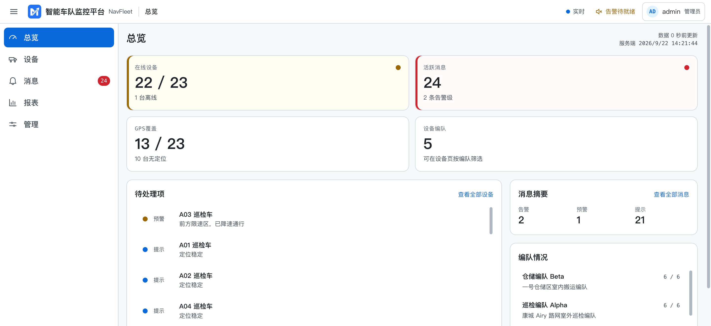
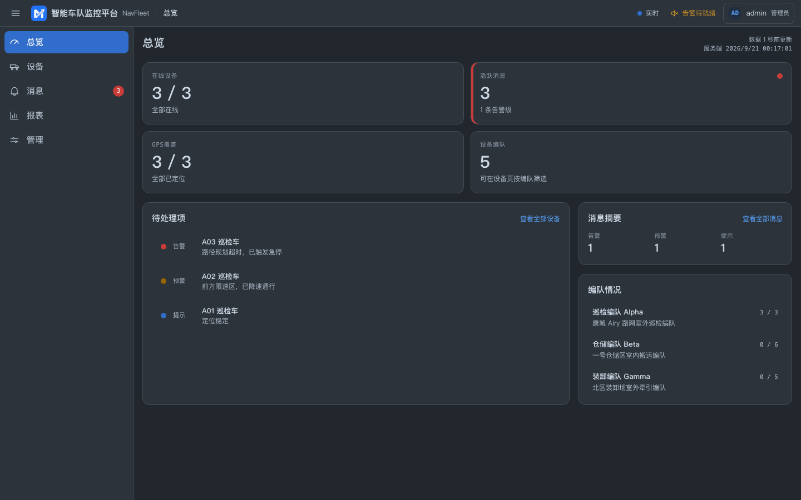
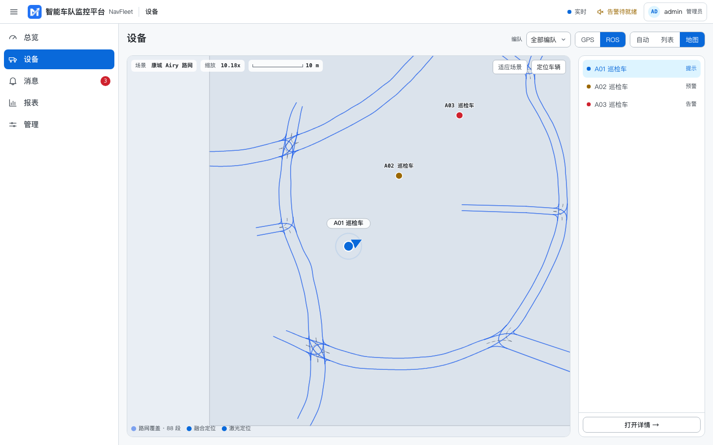
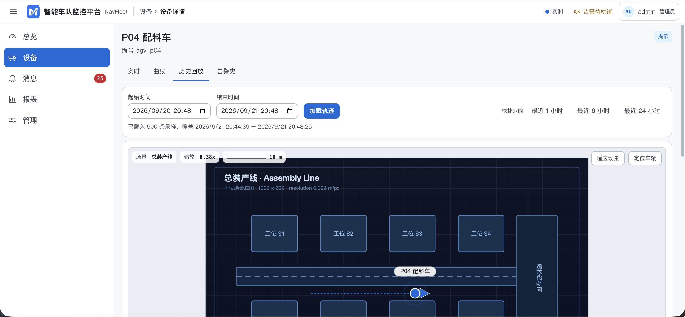
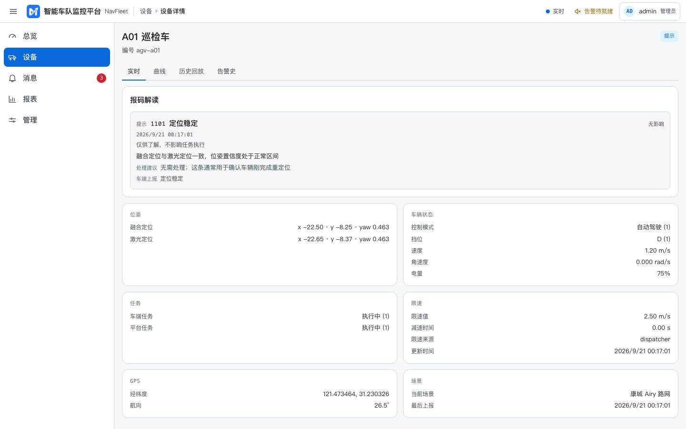
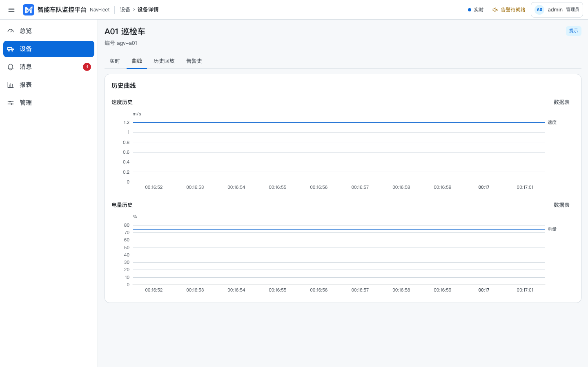
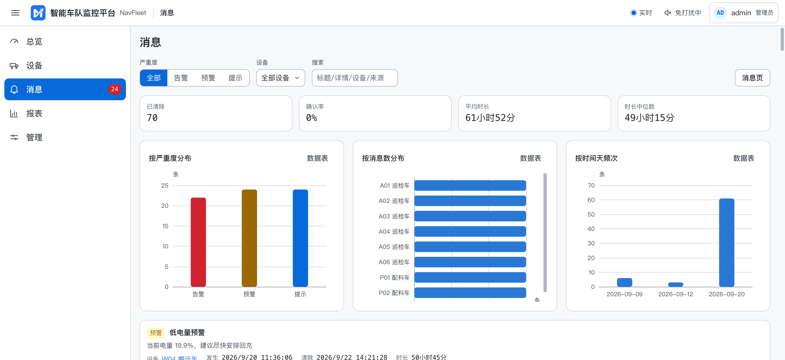
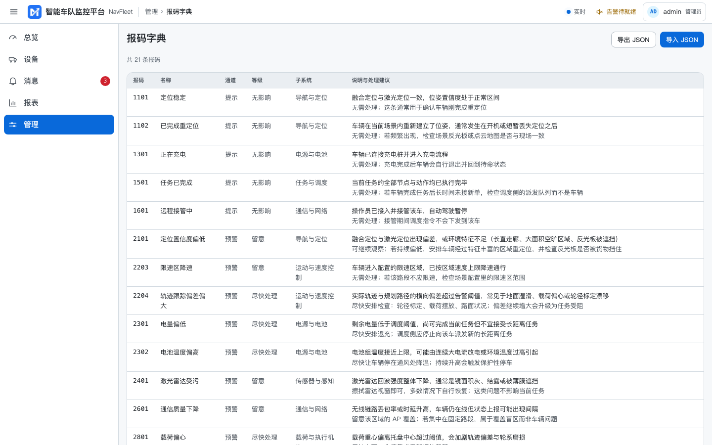
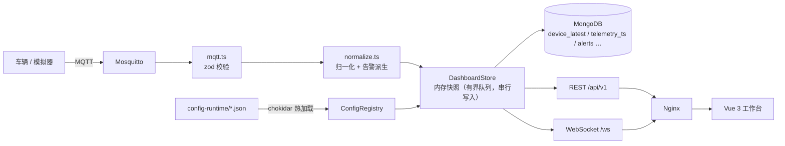

<!-- prettier-ignore-start -->
<div align="center">

# NavFleet · 智能车队监控平台

**面向 AGV / 巡检车 / 无人搬运车的实时运行态监控系统**

设备 MQTT 上报 → 归一化 → 内存快照 → MongoDB 持久化 → REST + WebSocket → Vue 3 工作台

[](https://github.com/yezhoufan2005/NavFleet/actions/workflows/ci.yml)
[](https://github.com/yezhoufan2005/NavFleet/releases)
[](LICENSE)
[](package.json)

</div>
<!-- prettier-ignore-end -->

## 界面一览

登录后是一个多页工作台：实时监控、设备详情、消息中心、报表、大屏值班、管理区共享同一份状态与同一条
WebSocket。以下截图由端到端测试（`npm run screenshots`）在真实后端 + 真实前端上自动生成，明暗两套主题
均为 GitHub Primer 配色（浅 Light default / 深 dark_dimmed）。

<table>
  <tr>
    <td width="50%"><br><sub><b>总览</b> · 四张统计卡 + 待处理项 + 消息摘要 + 编队情况</sub></td>
    <td width="50%"><br><sub><b>总览 · 深色主题</b> · 同一页面的 dark_dimmed 渲染</sub></td>
  </tr>
  <tr>
    <td width="50%"><br><sub><b>设备 · 场景地图</b> · Lanelet2 路网叠加，车辆按定位实时落点</sub></td>
    <td width="50%"><br><sub><b>设备 · 列表</b> · 可排序，状态按严重度着色</sub></td>
  </tr>
  <tr>
    <td width="50%"><br><sub><b>设备详情 · 实时</b> · 报码解读 + 位姿 / 状态 / 任务 / 限速 / GPS / 场景</sub></td>
    <td width="50%"><br><sub><b>设备详情 · 曲线</b> · 速度与电量分双图，绝不共轴</sub></td>
  </tr>
  <tr>
    <td width="50%"><br><sub><b>消息</b> · 按严重度分档，可筛选、确认</sub></td>
    <td width="50%"><br><sub><b>管理 · 报码字典</b> · 可导入 / 导出的报码释义表</sub></td>
  </tr>
</table>

## 目录

- [这是什么](#这是什么)
- [核心能力](#核心能力)
- [系统架构](#系统架构)
- [页面地图](#页面地图)
- [权限模型](#权限模型)
- [快速开始](#快速开始)
- [演示数据](#演示数据)
- [项目结构](#项目结构)
- [技术栈](#技术栈)
- [配置](#配置)
- [API 与实时事件](#api-与实时事件)
- [MQTT 接入约定](#mqtt-接入约定)
- [数据存储](#数据存储)
- [生产部署](#生产部署)
- [可观测性与运维](#可观测性与运维)
- [开发与质量门禁](#开发与质量门禁)
- [版本与发版](#版本与发版)
- [文档索引](#文档索引)
- [路线与已知边界](#路线与已知边界)
- [许可](#许可)

## 这是什么

NavFleet 把设备接入、实时展示、历史追踪、地图资源和运行期配置收进一套可部署、可维护的工程里。车辆
只需向 MQTT broker 发布遥测，其余环节由后端完成：字段归一化、告警派生、最新快照与时序落库、
WebSocket 广播。前端是一个多页工作台，实时监控、历史回放、消息中心、报表、大屏、设置等页面共享同一份
状态与同一条 socket。

**两条不变的红线，是有意的范围约束，不是待办：**

- **只读监控**：登录后才能访问任何数据，**不含控制下发**。下发指令与监控是两种安全模型，混在一个
  进程里会让两者都变脆。
- **单实例内网**：一台主机、Docker Compose、几十到数百台车。**不做多租户、不做水平扩展**——状态在
  单进程内存里，多实例需要跨实例 pub/sub，与这个定位不符。

**目标读者**是车队的运维与调度：一眼看清「哪台车此刻不对、为什么、能不能继续干活」，而不是从一串数字
里自己猜。这也解释了产品里反复出现的一个取舍——**宁可说「不知道 / 缺失 / 未配置」，也不编一个看起来
合理的值**：一个会误导人去操作的界面，比一个诚实承认自己没有数据的界面更糟。

## 核心能力

| 能力           | 说明                                                                                             |
| -------------- | ------------------------------------------------------------------------------------------------ |
| **MQTT 接入**  | 主题模板可配置；snake_case / camelCase 双写兼容；zod 校验后入库，被拒消息计入指标                |
| **状态归一化** | 增量上报自动与历史快照合并，避免字段丢失；`lidar` 定位在 `fusion` 缺失时回退                     |
| **告警派生**   | 提示 / 预警 / 告警三档报码 + 低电量、离线等规则；确认状态服务端落库（记录 who / when，可跨人）   |
| **报码字典**   | 内置可导入 / 导出的报码释义表：一个数字 → 含义 / 影响 / 处理建议；不在字典里的码诚实标注「未知」 |
| **三类地图**   | GPS（高德）、栅格 / 点云场景图、Lanelet2 路网（服务端解析 `.osm` 生成 overlay）                  |
| **历史与回放** | 基于 `telemetry_ts` 的历史曲线（速度 / 电量分双图）与可变速、可拖拽的时间轴回放                  |
| **报表**       | 服务端聚合的 KPI + 时序序列 + CSV 导出；大屏值班页面向无人值守墙面                               |
| **鉴权**       | JWT access + refresh（refresh cookie 限定 `/api/auth` 路径）、限流、账号锁定；真 RBAC 见下       |
| **可观测性**   | 分级健康探针、Prometheus 指标、request-id 贯穿日志、预置 Grafana 面板与 Alertmanager 告警规则    |
| **运行期配置** | `config-runtime/*.json` 热加载，改车队 / 编队 / 场景无需重启或重建镜像                           |
| **无障碍**     | WCAG 2.1 A + AA，axe-core 在 CI 中审计 **12 条路由 × 4 个视口 × 明暗两套主题**                   |

## 系统架构



边界很清楚：设备不知道前端和数据库的存在；前端只与后端说话，从不直连 broker；MongoDB 负责恢复与
查询，不参与实时推送路径。分层、模块职责、数据流与每个文件的作用见 [ARCHITECTURE.md](ARCHITECTURE.md)。

## 页面地图

前端 v3 控制台（`navfleet-console`）共 **15 条产品路由**，web history 模式。信息架构按「此刻 / 最近 /
那一段时间」三种问法组织，而不是把一切塞进一个仪表盘：

| 路由              | 页面         | 作用                                                                         |
| ----------------- | ------------ | ---------------------------------------------------------------------------- |
| `/`               | **总览**     | 落地页：在线 / 消息 / GPS 覆盖 / 编队四张卡 + 待处理项 + 消息摘要 + 编队情况 |
| `/devices`        | **设备**     | 列表 ⇄ 地图两个视图（可切 GPS / ROS 场景图，按编队筛选）                     |
| `/devices/:id`    | **设备详情** | 四个 tab：实时 / 曲线 / 历史回放 / 告警史；报码解读是它存在的理由            |
| `/alerts`         | **消息**     | 按严重度分档、按设备筛选、确认 / 取消确认（operator+）                       |
| `/alert-history`  | **消息史**   | 读 `/api/v1/alerts`，含起止时间与是否仍活跃                                  |
| `/reports`        | **报表**     | 服务端聚合的可用性 KPI + 时序 + CSV 导出                                     |
| `/wall`           | **大屏值班** | 面向无人值守墙面：KPI + 地图 + 滚动告警，长效 kiosk 账号登录                 |
| `/profile`        | **个人中心** | 自助改密、会话信息                                                           |
| `/admin`          | **管理**     | 落地页，下挂六个子页                                                         |
| `/admin/system`   | 系统状态     | 分辨「连不上后端」与「后端连不上 broker / Mongo」；列本机留存数据            |
| `/admin/scenes`   | 场景         | 逐个核对场景资源可达性，说清取不到会看到什么                                 |
| `/admin/users`    | 用户         | 增删改、启禁用、改角色、重置密码、强制下线、查看 / 撤销会话（admin）         |
| `/admin/codebook` | 报码字典     | 报码释义表，可导入 / 导出 JSON                                               |
| `/admin/notify`   | 外发         | 告警外发渠道配置                                                             |
| `/admin/audit`    | 审计         | 鉴权与用户管理操作的审计日志                                                 |

其余路径落 404。另有开发专用的 `/__charts-perf`（不在导航里）。

## 权限模型

三个角色 `admin` / `operator` / `viewer`，**逐路由强制**，并有每路由 × 每角色的集成测试网格
（`backend/test/http-rbac.test.ts`）钉住；前端用路由 `meta.roles` + 守卫做同样的区分。

| 能力                                                         | viewer | operator | admin |
| ------------------------------------------------------------ | :----: | :------: | :---: |
| 读全部监控数据（快照 / 设备 / 历史 / 告警 / 场景 / 报表）    |   ✅   |    ✅    |  ✅   |
| 确认 / 取消确认告警（`POST /api/alerts/(un)ack`）            |   —    |    ✅    |  ✅   |
| 用户管理（`/api/users*`）、管理区 `/admin/*`                 |   —    |    —     |  ✅   |
| 调试注入（`/api/debug/ingest`，且需 `DEBUG_INGEST_ENABLED`） |   —    |    —     |  ✅   |

自 Phase 16A 起 `operator` 有专属操作面（告警确认），与 `viewer` 不再等价；配置仍走文件热加载、不走
API。**登出 / 改密 / 禁用 / 改角色会立即失效已签发的 token**（每请求校验 `tokenVersion` 与 `enabled`）。
账号级登录锁定、审计日志、会话管理均已落地。

## 快速开始

### 环境要求

- Node.js **>= 22**（CI 在 22 / 24 上跑；node 20 已 EOL 并移出矩阵）
- Docker + Docker Compose（容器化部署）
- MongoDB 与 MQTT broker（compose 编排已包含；本地开发可只跑其一，后端在两者都不可达时降级到内存态）

仓库是 **npm workspaces 单体仓库**，只有一个根 lockfile。所有命令都从仓库根执行：

```bash
git clone https://github.com/yezhoufan2005/NavFleet.git
cd NavFleet
npm ci
```

### 方式一：Docker 一键起（推荐）

```bash
cp deploy/.env.example deploy/.env
```

编辑 `deploy/.env`，**至少**填好这四项 —— broker 已关闭匿名访问，口令留空时 compose 会直接报错退出，
而不是起一个谁都能连的 broker：

```dotenv
MQTT_SUBSCRIBER_PASSWORD=<后端连 broker 用>
MQTT_PUBLISHER_PASSWORD=<车辆/模拟器发布用>
JWT_SECRET=<openssl rand -hex 32>
ADMIN_PASSWORD=<初始管理员口令>
```

```bash
docker compose --env-file deploy/.env -f deploy/docker-compose.yml up -d --build
```

打开 <http://127.0.0.1:8080>，用 `ADMIN_USERNAME`（默认 `admin`）与 `ADMIN_PASSWORD` 登录。

### 方式二：本地开发

```bash
scripts/dev.sh
```

同时起后端（:3000）与 **v3 控制台**（:5273）—— 也就是 compose 实际部署的那一套。若检测到
`127.0.0.1:1883` 上有 broker，会自动运行演示发布器，走的是真实链路，只有数据是演示数据。`--no-mock`
关掉它，`--mock` 强制打开。`--legacy` 起已冻结的 v1.0.0 那套（:5173），只在验证回滚时需要。

高德地图 Key **按 workspace 各自一份**（`frontend-next/.env` 与 `frontend/.env`，都不进仓库）。缺了它
GPS 面板显示「未配置 Key」、其余功能正常；`dev.sh` 会在文件缺失时提示一句。

开发环境把 `ADMIN_PASSWORD` 留空时会创建 `admin / admin123` 并打印一条告警。**生产环境留空则拒绝创建
默认管理员** —— 与其偷偷放一个弱口令进去，不如启动失败。

手动分别启动、以及高德地图 Key 的配置，见 [deploy/docs/deployment.md](deploy/docs/deployment.md)。

### 生成界面截图

顶部「界面一览」的图由一个独立的 Playwright 配置驱动（不在 CI 的 e2e 套件里），复用同一个内存态后端，
**不需要 Docker / MongoDB / MQTT**：

```bash
npm run screenshots   # 启后端 + 控制台 → 播种演示车队 → 逐页截图到 docs/screenshots/
```

## 演示数据

`config-runtime/` 里预置了 **23 台车、5 个编队、5 个场景**（栅格 SVG、CloudPoint 点云、Lanelet2 路网
各有实例）。演示发布器沿 lanelet 车道中心线行驶，而不是绕一个与路网无关的矩形跑：

```bash
npm run mock:mqtt -- --count 4 --interval 1000
```

它会连到 `MQTT_URL`（默认 `mqtt://127.0.0.1:1883`），按 `config-runtime/vehicles.json` 里的车辆发布
遥测。压测用 `backend/scripts/load-ingest.ts`。

> 说明：车辆配置**不会凭空创建车辆**——页面里出现的车来自 MQTT、调试注入或 MongoDB 恢复。所以顶部
> 截图里只有 3 台车（端到端测试注入的最小集），而完整演示数据是 23 台。

## 项目结构

```text
NavFleet/
├─ backend/              # Node 22 + TypeScript + Express 5
│  ├─ src/
│  │  ├─ app.ts          # Express 组装：中间件顺序、鉴权闸门、双前缀挂载
│  │  ├─ index.ts        # 组合根：只负责装配运行时并启动
│  │  ├─ routes/         # ops / fleet / scenes / users / debug / docs
│  │  ├─ auth/           # 登录、JWT、口令哈希、RBAC 中间件
│  │  ├─ mqtt.ts         # broker 连接、订阅、校验后摄入
│  │  ├─ normalize.ts    # 遥测归一化 + 告警派生
│  │  ├─ store.ts        # 内存快照（有界队列、串行写入）+ 事件广播
│  │  ├─ persistence.ts  # MongoDB 读写、索引、TTL、写回缓冲
│  │  ├─ migrations/     # schema 迁移（版本标记集合，启动自动执行）
│  │  ├─ configRegistry.ts  # 运行期配置热加载
│  │  ├─ laneletOsm.ts   # Lanelet2 .osm 解析为 overlay
│  │  └─ metrics.ts      # prom-client 注册表
│  └─ test/              # Vitest + supertest
├─ frontend-next/        # v3 控制台（navfleet-console）—— **默认部署的这一套**
│  ├─ src/               # 15 条产品路由、web history、Tailwind v4 双主题、Reka UI、ECharts（懒加载）
│  └─ test/              # Vitest + jsdom + @vue/test-utils
├─ frontend/             # v1.0.0 控制台 —— **已冻结**，保留作一行命令的回滚，不再是交付产物
├─ packages/shared/      # @navfleet/shared —— 领域类型单一来源
├─ packages/fleet-core/  # @navfleet/fleet-core —— 两个前端共用的归一化 / 派生 / REST 访问逻辑
├─ e2e/                  # Playwright + axe-core（另含独立的 screenshots.config.ts）
├─ config-runtime/       # 运行期配置与地图资源（热加载，不进镜像）
├─ deploy/               # compose 编排、nginx、mosquitto、prometheus、grafana、文档、脚本
├─ docs/                 # 架构 / 设计系统 / 发版说明 / 归档 / 界面截图
└─ scripts/              # dev.sh（开发）/ smoke.sh（API 契约）/ verify-stack.sh（整栈验收）
```

## 技术栈

| 层           | 选型                                                                                                                                                                                          |
| ------------ | --------------------------------------------------------------------------------------------------------------------------------------------------------------------------------------------- |
| **前端**     | Vue 3（`<script setup lang="ts">`）· Vite · vue-router（web history）· Pinia · Tailwind v4（双主题令牌）· Reka UI（无样式可访问组件）· ECharts（懒加载）· 高德地图 JS API                     |
| **后端**     | Node 22 · TypeScript · Express 5 · `ws` · `mqtt` · `mongodb` · `zod`（fail-fast）· `chokidar` · `pino` · `prom-client` · `helmet` / `cors` / `express-rate-limit` / `bcrypt` / `jsonwebtoken` |
| **数据**     | MongoDB（最新快照 / 时序遥测 / 告警 / 用户 / 审计），时序集合 + TTL                                                                                                                           |
| **部署**     | Nginx（非 root，边缘入口）· Mosquitto（关匿名 + 双向 ACL）· Docker Compose（三网段隔离）                                                                                                      |
| **设计系统** | 由 `docs/tools/gen-design-system-preview.py` 生成 `ramp.css` / `semantic.css`；GitHub Primer 配色（浅 Light default / 深 dark_dimmed），明暗自动配对、WCAG 校验                               |
| **质量**     | Vitest + supertest + jsdom · Playwright + axe-core · ESLint 10（type-aware）· Prettier · 覆盖率 ratchet                                                                                       |

## 配置

后端所有环境变量都经 **zod 校验并 fail-fast** —— 配错一个数字就启动失败，而不是静默退回默认值。后端
自己校验 **39 个键**；连 compose 与三个叠加文件读的（broker 凭据、备份、监控）共 62 个，逐项说明见
[deploy/docs/config-reference.md](deploy/docs/config-reference.md)。最需要注意的几个：

| 变量                    | 默认                             | 说明                                                            |
| ----------------------- | -------------------------------- | --------------------------------------------------------------- |
| `JWT_SECRET`            | 空                               | **生产必填**。留空则每次重启使所有会话失效                      |
| `ADMIN_PASSWORD`        | 空                               | 生产留空时拒绝创建默认管理员                                    |
| `AUTH_ENABLED`          | `true`                           | 关掉会让全部接口对匿名开放，仅用于本地调试                      |
| `DEBUG_INGEST_ENABLED`  | `false`                          | 开启 `POST /debug/ingest`，可注入任意状态；生产开启会 fail-fast |
| `MQTT_TOPIC_PATTERN`    | `/fleet/{deviceId}/vehicle_info` | 订阅主题由它推导，不是硬编码                                    |
| `TRUST_PROXY`           | `0`（compose 为 `1`）            | 反代跳数。配错会让整个部署共用一个限流额度                      |
| `CORS_ORIGINS`          | 空                               | 通配符在生产环境会 fail-fast                                    |
| `OFFLINE_AFTER_SECONDS` | `60`                             | 超时未上报即判离线                                              |

**运行期配置**（车队、车辆、编队、场景）走 `config-runtime/*.json`，由 chokidar 监听热加载，改完即生效，
无需重启或重建镜像。

## API 与实时事件

域接口同时挂在 **`/api/v1`（新客户端用这个）和裸 `/api`（保留兼容）** 下，两者完全等价 —— 挂两次而
不是做 30x 跳转，是为了不丢方法与请求体。鉴权路径**故意不带版本**：refresh cookie 的作用域被限定在
`/api/auth`，加一个带版本的孪生路径会让这个限制失效。

| 方法   | 路径                                       | 鉴权        | 说明                                         |
| ------ | ------------------------------------------ | ----------- | -------------------------------------------- |
| `GET`  | `/health` · `/health/ready`                | 公开        | 存活 / 就绪探针（就绪真实探测 Mongo / MQTT） |
| `GET`  | `/metrics`                                 | 公开\*      | Prometheus 指标                              |
| `POST` | `/api/auth/login` · `/refresh` · `/logout` | 公开/cookie | 登录、续签、注销                             |
| `GET`  | `/api/auth/me`                             | 需登录      | 当前用户与角色                               |
| `POST` | `/api/auth/change-password`                | 需登录      | 自助改密（改后重签当前会话）                 |
| `GET`  | `/api/v1/fleet/snapshot`                   | 需登录      | 全量车队快照                                 |
| `GET`  | `/api/v1/formations`                       | 需登录      | 编队列表                                     |
| `GET`  | `/api/v1/devices/:deviceId/history`        | 需登录      | 历史遥测（分页、时间范围）                   |
| `GET`  | `/api/v1/alerts`                           | 需登录      | 告警查询（严重度 / 设备 / 状态）             |
| `POST` | `/api/v1/alerts/ack` · `/unack`            | operator+   | 确认 / 取消确认告警                          |
| `GET`  | `/api/v1/scenes` · `/:id` · `/:id/overlay` | 需登录      | 场景定义与 Lanelet2 overlay                  |
| `GET`  | `/api/v1/reports/*`                        | 需登录      | 服务端聚合的报表数据                         |
| `*`    | `/api/v1/users*`                           | admin       | 用户 CRUD、重置密码、启禁用、会话            |
| `GET`  | `/api/v1/vehicles` · `PUT`                 | admin       | 设备接入向导：读 / 写 `vehicles.json` 配置   |
| `GET`  | `/api/v1/formation-config` · `PUT`         | admin       | 设备接入向导：读 / 写 `formations.json` 配置 |
| `POST` | `/api/v1/debug/ingest`                     | admin       | 注入状态，**默认不挂载**                     |
| `GET`  | `/openapi.json` · `/docs`                  | 需登录      | OpenAPI 3.1 + 同源 Swagger UI                |

\* 边缘 nginx **不路由** `/metrics`：Prometheus 从容器网络内部抓取，公网 / 局域网碰不到它。入参 schema
由 zod 验证器生成，**结构上无法与实现 drift**。

**WebSocket** `/ws`：升级握手只认 cookie 里的 token（不接受 query 参数，避免 token 进日志）。事件为
`fleet.snapshot`（全量替换）与 `fleet.delta`（增量），另有 `alert.created` / `alert.cleared` /
`device.online` / `device.offline` 与应用层 ping/pong 心跳；前端指数退避重连。

## MQTT 接入约定

默认订阅两个主题，均由 `MQTT_TOPIC_PATTERN` 推导：

```text
/fleet/{deviceId}/vehicle_info   遥测
/fleet/{deviceId}/status         在线状态
```

遥测 payload 同时接受 snake_case 与 camelCase，字段可缺省 —— 增量上报会与该车已有快照合并，不会把
未上报的字段清空。完整字段表见 [deploy/docs/config-reference.md](deploy/docs/config-reference.md)。

broker 侧强制账号与双向 ACL：发布账号只能写车辆主题，后端账号只能读。1883 端口只绑 `127.0.0.1`。

## 数据存储

MongoDB 承担恢复与查询，不在实时推送路径上。主要集合：

| 集合                | 内容                                      | 关键点                                              |
| ------------------- | ----------------------------------------- | --------------------------------------------------- |
| `device_latest`     | 每台设备的最新快照                        | 服务重启后据此恢复页面状态                          |
| `telemetry_ts`      | 时序遥测（time series collection）        | 保留期 `TELEMETRY_RETENTION_SECONDS`，供历史 / 报表 |
| `alerts`            | 活动与已清除告警                          | TTL 落在 `lastSeenAt`，含 who/when 的确认记录       |
| `users`             | 用户模型（含 `passwordHash`、角色、状态） | `tokenVersion` 支撑「登出即失效」                   |
| `audit_log`         | 鉴权与用户管理操作审计                    | 登录 / 登出 / 改密 / 用户增删改                     |
| `schema_migrations` | 迁移版本标记                              | 启动时顺序化、幂等执行，失败即拒绝启动              |

字段与索引明细见 [ARCHITECTURE.md](ARCHITECTURE.md) 第 9 节。

## 生产部署

基础编排之上是四个**叠加文件**，按需组合。用叠加而不是 compose `profiles:`，是因为 compose 会在应用
profile **之前**插值整个文件 —— profiled 服务上一个必填的 `${VAR:?}` 会让所有没启用该 profile 的部署
`up` 失败。

| 叠加                                 | 作用                                                                      |
| ------------------------------------ | ------------------------------------------------------------------------- |
| `docker-compose.yml`                 | 基础：nginx / web / backend / mongo / mosquitto，三网段隔离               |
| `docker-compose.tls.yml`             | TLS 终止、HSTS、HTTP 308 跳转、`COOKIE_SECURE` 强制 true                  |
| `docker-compose.monitoring.yml`      | Prometheus + Alertmanager + Grafana，预置数据源、16 个面板、15 条告警规则 |
| `docker-compose.backup.yml`          | 定时 mongodump，含恢复演练脚本                                            |
| `docker-compose.legacy-frontend.yml` | 回滚：`web` 换回 v1.0.0 控制台（默认是 `frontend-next` 那套）             |

```bash
# 基础 + TLS + 监控
docker compose --env-file deploy/.env \
  -f deploy/docker-compose.yml \
  -f deploy/docker-compose.tls.yml \
  -f deploy/docker-compose.monitoring.yml up -d
```

网络分三段，让 web 层被拿下不等于数据库和 broker 也被拿下：`edge`（nginx ↔ web ↔ backend，唯一有
主机端口的段）、`data`（backend ↔ mongo，`internal: true`）、`bus`（backend ↔ mosquitto）。后端是
唯一同时在三段上的服务；`edge` 上的东西根本寻址不到 mongo。

两个 nginx 都以非 root 运行；`mongo` 钉 `7.0`（本项目不需要 8.0 的任何能力，而 8.0+ 在部分 Linux 内核
上拒绝启动）。镜像随 release 发布到 GHCR。完整步骤、TLS 证书、反代配置见
[deploy/docs/deployment.md](deploy/docs/deployment.md)。

## 可观测性与运维

- **分级探针**：`/health` 存活；`/health/ready` 就绪（真实探测 Mongo 与 MQTT，不只看进程活着）。`store`
  未就绪返回 **503**，Mongo / MQTT 断开只算 `degraded`（后端降级运行而非拒绝服务）
- **指标**：在线设备数、消息吞吐、被拒消息、告警数、WS 连接数与广播背压、Mongo 连接 / 写入 / 写失败
  计数与写入延迟直方图与缓冲长度、摄入队列深度与丢弃计数、per-route 请求直方图（标签用路由模板，避免维度爆炸）
- **日志**：pino 结构化输出，request-id 贯穿日志与 500 响应体，口令 / token / URI 全部脱敏
- **告警规则**：15 条，全部写在真实暴露的指标上
- **告警投递**：Alertmanager（分组 / 去重 / 抑制 / 静默）。**出厂接收器是空的** —— 告警在它的界面里
  可见，但在你配置邮件或 webhook 之前不外发，理由见
  [deploy/alertmanager/alertmanager.yml](deploy/alertmanager/alertmanager.yml)
- **备份**：`deploy/tools/mongo-backup.sh` / `mongo-restore.sh`，以及 `restore-drill.sh` 真实恢复演练。
  见 [deploy/docs/backup-and-restore.md](deploy/docs/backup-and-restore.md)

## 开发与质量门禁

```bash
npm run lint               # eslint 10（type-aware，含 e2e/）
npm run format:check       # prettier
npm run typecheck          # tsc / vue-tsc，四个 workspace + e2e
npm test                   # 单元 + 集成（不含覆盖率门槛，见下）
npm run e2e                # Playwright（自带后端与前端，不需要 Mongo/MQTT/docker）
npm run build              # shared → backend → frontend → console
npm run check:map-contrast # 地图配色的对比度门槛
npm run check:deploy       # 部署接线：nginx 上游 / 叠加文件 / 镜像钉版 / .env.example 齐全
```

> ⚠️ `npm test` **不跑覆盖率门槛**，也不含 `check:map-contrast` / `check:deploy`。本地要对齐 CI，须另跑
> `test:coverage` 与两个 `check:*`——见 [CONTRIBUTING.md](CONTRIBUTING.md)。

### 三个脚本，各管一层（递进、不重复）

| 脚本                      | 需要 Docker | 覆盖的那一层                                                             | 用时 |
| ------------------------- | ----------- | ------------------------------------------------------------------------ | ---- |
| `scripts/dev.sh`          | 否          | 开发：vite + tsx 热重载，可选演示发布器                                  | 持续 |
| `scripts/smoke.sh`        | 否          | 单个后端进程的 API 契约（鉴权边界，24 条断言）                           | 秒级 |
| `scripts/verify-stack.sh` | **是**      | **整栈**：五个服务 healthcheck、边缘 nginx 路由、跨容器 DNS（56 条断言） | 分钟 |

只有第三个能回答这类问题：`/docs` 有没有真被边缘路由、`/metrics` 在边缘是不是 SPA 兜底、broker 凭据
对不对、Mongo 落库到查询是否通。

| 门禁     | 数量    | 说明                                                                                                    |
| -------- | ------- | ------------------------------------------------------------------------------------------------------- |
| 后端测试 | **612** | Vitest + supertest：路由、鉴权、校验、迁移、错误中间件、WS、配置注册表、Mongo 语句形状                  |
| 前端测试 | **701** | Vitest + jsdom：store、实时链路、视图交互、composable（`navfleet-console`；fleet-core 另 168）          |
| E2E      | **87**  | Playwright：登录、总览、地图、消息、历史回放、报表、大屏、404 + axe-core 无障碍审计（新旧两套前端各跑） |
| 覆盖率   | ratchet | 前后端各有阈值，只许上调，不许为了让红变绿而下调                                                        |

CI 在 Node 22 / 24 上跑 **9 个 job**（deploy 接线、backend+shared×2、冻结前端×2、console×2、e2e、
GitGuardian）。提交前 husky + lint-staged 会对暂存文件跑 prettier；完整门禁仍在 CI。约定式提交 +
release-please 自动出 CHANGELOG 与 GHCR 镜像。贡献流程见 [CONTRIBUTING.md](CONTRIBUTING.md)。

## 版本与发版

版本号只问一句话：**用户能拿到什么。** 一次发版里用户可见的只有修复就是 Z；只有一整块功能真正到达
用户手里才动 Y。约定式提交 + release-please 生成 CHANGELOG 与 GHCR 镜像；**每次实际发版由维护者
手动批准**（合并 release PR）。

| 版本      | 主题                                                                    |
| --------- | ----------------------------------------------------------------------- |
| `1.0.0`   | 基准版：MQTT 接入 / 快照 / 历史 / 地图 / 一键部署                       |
| `1.0.1–3` | P0 健壮性批次（WebSocket 崩溃、摄入背压、断连缓冲、内存上界、优雅关闭） |
| `1.1.0`   | **新前端替换旧前端**：v3 控制台（Vue 3 + Tailwind + Reka UI + ECharts） |
| `1.2.0`   | 用户体系与真 RBAC（用户 CRUD、schema 迁移、审计、token 即时失效）       |
| `1.3.0`   | 告警体系深化（确认落库、历史、规则、外发）                              |
| `1.4.0`   | 报表与数据价值（服务端聚合、CSV 导出、kiosk 大屏值班）                  |
| `1.5.0`   | **前端焕新**：GitHub Primer 明暗双主题 + 组件规范化 + 一批体感修复      |

各版本发版说明在 [docs/release-notes/](docs/release-notes/)；完整变更见 [CHANGELOG.md](CHANGELOG.md)。

## 文档索引

| 文档                                                                   | 内容                                           |
| ---------------------------------------------------------------------- | ---------------------------------------------- |
| [ARCHITECTURE.md](ARCHITECTURE.md)                                     | 分层、模块职责、数据流、前后端各文件的作用     |
| [deploy/docs/deployment.md](deploy/docs/deployment.md)                 | 部署步骤、TLS、反代、镜像发布                  |
| [deploy/docs/config-reference.md](deploy/docs/config-reference.md)     | 62 个环境变量 + 运行期 JSON 全字段             |
| [deploy/docs/backup-and-restore.md](deploy/docs/backup-and-restore.md) | 备份、恢复、演练                               |
| [docs/frontend-design-system.md](docs/frontend-design-system.md)       | 设计系统：令牌体系、GitHub Primer 映射、生成器 |
| [CONTRIBUTING.md](CONTRIBUTING.md)                                     | 分支、提交规范、本地门禁                       |
| [ROADMAP.md](ROADMAP.md)                                               | 当前路线图（Phase 14–18 的计划与决策）         |
| [docs/roadmap-archive.md](docs/roadmap-archive.md)                     | 已完成阶段的记录：Phase 0–13                   |
| [docs/release-notes/](docs/release-notes/)                             | 各版本发版说明（Release 页面正文的来源）       |

## 路线与已知边界

有意不包含的东西，以及已知的限制：

- **不做控制下发、不做多租户** —— 范围约束，不是待办。
- **不做水平扩展**：状态在单进程内存里，与「内网单实例」的定位一致。
- **`frontend/`（v1.0.0）已冻结**：代码全留、不再改动，回滚只需一行 `dockerfile:`。它有 12 个 `.vue`
  仍是普通 `<script setup>`（未加 `lang="ts"`）——这**不再是待办**；部署的 `frontend-next/` 全部 SFC
  都带 `lang="ts"`。
- **MQTT 摄入队列有界**：broker 灌得足够快时丢最旧的可丢帧（仅遥测），深度与丢弃数上 `/metrics`。
- **`prom-client` 上游已 deprecated**，待替换。
- **Lanelet2 解析不过滤 `delete="true"`**：示例网络里带该标记的 lanelet 目前仍会绘制。
- **axe 的 `incomplete` 桶未断言**：半透明与渐变表面会落入该桶而不产生违规，这类对比度问题仍需人工审阅。

后续规划（`v1.5.0` 之后）见 [ROADMAP.md](ROADMAP.md) 的「剩余未完成任务总览」：Phase 17D（数据利用
清零）、Phase 18（交付成熟度收尾），以及若干长期搁置项。

## 许可

[MIT](LICENSE) © 2026 yezhoufan
