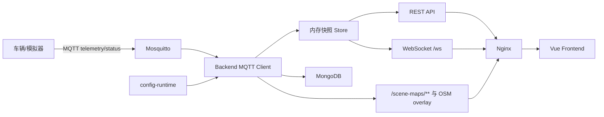

# 智能车队监控平台（NavFleet）

该项目是一个面向 AGV/智能车队的实时监控系统。系统通过 MQTT 接收车辆遥测和在线状态，后端统一归一化数据并写入 MongoDB，同时通过 REST API 和 WebSocket 推送给 Vue 前端，用于展示车辆列表、编队、GPS 地图、场景地图、点云地图、Lanelet2 路网和告警信息。

前端为多页工作台（vue-router + Pinia）：**实时监控**（设备/编队/地图/详情）、**历史回放**（按设备与时间范围回放轨迹）、**告警中心**（按严重度/设备筛选、确认、分页）。系统定位为**只读监控**：完整登录 + RBAC（管理员/操作员/只读），不含控制下发与多租户。后端提供分级健康探针、Prometheus 指标与 OpenAPI 文档（见 §7、§9）。

当前交付包已经包含可直接运行的 Docker Compose 编排：

- `nginx`：统一 Web 入口，代理前端、后端接口、WebSocket 和地图资源。
- `frontend`：Vue 3 + Vite 构建后的静态页面。
- `backend`：Node.js 20 + TypeScript 后端服务。
- `mongo`：遥测历史、最新快照和告警存储。
- `mosquitto`：本地 MQTT Broker，便于完整闭环运行和验收。

## 1. 快速启动

### 1.1 Docker 一键启动

```bash
cd /path/to/NavFleet
cp deploy/.env.example deploy/.env

# MQTT broker 已关闭匿名访问，这两个口令没有默认值：留空时 compose 会直接报错退出，
# 而不是起一个谁都能连的 broker。
printf 'MQTT_SUBSCRIBER_PASSWORD=%s\nMQTT_PUBLISHER_PASSWORD=%s\n' \
  "$(openssl rand -hex 16)" "$(openssl rand -hex 16)" >> deploy/.env

docker compose --env-file deploy/.env -f deploy/docker-compose.yml up -d --build
```

默认访问地址：

```text
http://127.0.0.1:8080
```

> **生产部署前必改**：`deploy/.env` 中的 `JWT_SECRET`（留空则每次重启失效所有会话）、`ADMIN_PASSWORD`（生产环境留空将拒绝创建默认管理员）、以及 `MONGO_INITDB_ROOT_PASSWORD` / `MONGO_URI` 中的数据库口令。开发环境留空 `ADMIN_PASSWORD` 时会创建 `admin / admin123` 并打印告警。

默认 MQTT 接入地址：

```text
mqtt://127.0.0.1:1883
```

检查服务：

```bash
curl http://127.0.0.1:8080/health
curl http://127.0.0.1:8080/api/scenes
curl http://127.0.0.1:8080/api/fleet/snapshot
```

### 1.2 发送模拟车辆数据

Docker 启动后，可以在本机运行模拟发布脚本：

```bash
cd backend
npm install
npm run mock:mqtt -- --broker mqtt://127.0.0.1:1883 --interval 1000
```

模拟脚本默认发布与 `config-runtime/vehicles.json` 一致的示范车队（覆盖三类地图：Lanelet 路网、栅格图片、点云），向 `/fleet/{deviceId}/vehicle_info` 和 `/fleet/{deviceId}/status` 发布数据，涵盖不同控制模式/挡位/任务状态、提示/预警/告警三档告警、低电量与离线检测。页面收到数据后会显示车辆、告警和地图位置。`--count` 可限制设备数（超过示范车队数量时会合成额外设备用于压测）。

## 2. 项目目录

```text
NavFleet/
├─ backend/                 # Node.js + TypeScript 后端
│  ├─ src/
│  │  ├─ index.ts           # Express / WebSocket / MQTT 入口
│  │  ├─ config.ts          # 环境变量与运行路径
│  │  ├─ configRegistry.ts  # 运行期配置加载、校验和热更新
│  │  ├─ normalize.ts       # MQTT/API payload 归一化
│  │  ├─ store.ts           # 内存快照、告警、编队和广播
│  │  ├─ persistence.ts     # MongoDB 持久化（含内存兜底）
│  │  ├─ topics.ts          # MQTT 主题模式解析
│  │  ├─ validation.ts      # zod 入参校验
│  │  ├─ laneletOsm.ts      # Lanelet2 OSM 解析
│  │  ├─ openapi.ts         # OpenAPI 3.1 文档
│  │  ├─ auth/              # JWT + RBAC（service/tokens/middleware/routes/passwords）
│  │  └─ types.ts           # 类型定义
│  ├─ scripts/
│  │  ├─ mock-mqtt.ts       # 模拟 MQTT 发布脚本
│  │  └─ load-ingest.ts     # 免 broker 的压测脚本
│  ├─ test/                 # Vitest 单测
│  └─ Dockerfile
├─ frontend/                # Vue 3 + Vite 前端
│  ├─ src/
│  │  ├─ main.ts            # 应用入口（Pinia + vue-router）
│  │  ├─ App.vue            # 鉴权门 + 布局 + 导航
│  │  ├─ router/            # hash 路由
│  │  ├─ views/             # 实时监控 / 历史回放 / 告警中心
│  │  ├─ stores/            # Pinia fleet store
│  │  ├─ services/          # REST 客户端
│  │  ├─ lib/               # 纯数据归一化
│  │  ├─ composables/       # 鉴权、主题、通知、告警确认
│  │  ├─ components/        # GPS 地图、ROS/场景地图、登录、通知
│  │  ├─ utils/             # 高德地图、坐标、点云、枚举文案
│  │  └─ assets/
│  └─ Dockerfile
├─ config-runtime/          # 运行期配置和地图资源
│  ├─ fleet.json
│  ├─ vehicles.json
│  ├─ formations.json
│  ├─ scenes.json
│  └─ scene-maps/
├─ deploy/
│  ├─ docker-compose.yml
│  ├─ .env.example
│  ├─ nginx/default.conf
│  ├─ mosquitto/mosquitto.conf
│  ├─ docs/
│  └─ tools/                # Mongo 备份/恢复脚本
├─ scripts/                 # smoke.sh 等契约冒烟脚本
└─ ARCHITECTURE.md
```

## 3. 系统架构



核心原则：

- 前端不直连 MQTT，只访问后端接口和 WebSocket。
- 后端是车辆配置、编队配置、场景配置的唯一运行时来源。
- `config-runtime/` 是可挂载、可热更新的运行期配置目录，修改配置无需重建镜像。
- MongoDB 保存最新快照、遥测历史和告警记录；系统实时展示主要依赖内存快照和 WebSocket。

更详细的架构说明见 [ARCHITECTURE.md](./ARCHITECTURE.md)。

## 4. 本地开发

### 4.1 一键启动（推荐）

在仓库根目录执行，脚本会同时拉起后端 (:3000) 与前端 (:5173)。演示数据不写死在脚本里：检测到本机 MQTT broker（`127.0.0.1:1883`）时，会用 `config-runtime` 定义的车队跑模拟发布器（真实 MQTT 链路，仅遥测值为演示）：

```bash
scripts/dev.sh            # 启动前后端；有 broker 时自动发布演示车队数据
scripts/dev.sh --mock     # 强制发布演示数据（需本机 1883 broker）
scripts/dev.sh --no-mock  # 只启动前后端，不发布演示数据
```

> 需要演示数据但本机没有 broker 时，可先用 Compose 起一个：`docker compose --env-file deploy/.env -f deploy/docker-compose.yml up -d mosquitto`。该 broker 已关闭匿名访问，但无需手工导出凭据：`scripts/dev.sh` 会从 `deploy/.env` 里读出 `MQTT_SUBSCRIBER_*`（给后端订阅）与 `MQTT_PUBLISHER_*`（给发布器）并分别注入。

启动后访问 `http://127.0.0.1:5173`，默认登录账号 `admin / admin123`（脚本内置的开发口令，仅用于本地）。`Ctrl+C` 停止全部服务。

快速校验后端接口契约（无需浏览器）：

```bash
scripts/smoke.sh          # 启动临时后端并断言鉴权与关键接口
```

### 4.2 环境要求

- Node.js 20+
- npm
- MongoDB，可用 Docker 或本机服务（缺省时后端以内存回退运行）
- MQTT Broker，可用本项目 Compose 内置 Mosquitto

### 4.3 手动启动后端

复制环境变量示例：

```bash
cd backend
cp .env.example .env
```

Windows 本机建议把 `CONFIG_ROOT_PATH` 改成绝对路径，例如：

```env
CONFIG_ROOT_PATH=C:\path\to\NavFleet\config-runtime
```

启动：

```bash
npm install
npm run dev
```

后端默认监听：

```text
http://127.0.0.1:3000
```

### 4.4 手动启动前端

```bash
cd frontend
npm install
npm run dev
```

前端默认监听：

```text
http://127.0.0.1:5173
```

开发环境下，Vite 会把这些路径代理到后端：

- `/api`
- `/ws`
- `/health`
- `/scene-maps`

### 4.5 高德地图 Key

GPS 地图依赖高德地图 JS API。前端开发时可在 `frontend/.env` 配置：

```env
VITE_AMAP_KEY=高德Key
VITE_AMAP_SECURITY_JS_CODE=高德安全密钥
```

Docker 部署时在 `deploy/.env` 中填写同名变量后重新构建前端镜像。

## 5. Docker 部署

推荐部署入口是：

```bash
docker compose --env-file deploy/.env -f deploy/docker-compose.yml up -d --build
```

常用命令：

```bash
docker compose --env-file deploy/.env -f deploy/docker-compose.yml ps
docker compose --env-file deploy/.env -f deploy/docker-compose.yml logs -f backend
docker compose --env-file deploy/.env -f deploy/docker-compose.yml down
```

默认端口：

| 服务      | 容器内端口 | 宿主机端口       | 说明                           |
| --------- | ---------- | ---------------- | ------------------------------ |
| Nginx     | `8080`     | `8080`           | Web 入口（容器以非 root 运行） |
| Mosquitto | `1883`     | `127.0.0.1:1883` | MQTT 接入，仅本机可达且需凭据  |
| Backend   | `3000`     | 不直接暴露       | 通过 Nginx 代理                |
| MongoDB   | `27017`    | 不直接暴露       | 仅 `data` 内部网络可达         |

如果要使用 80 端口作为正式访问入口，把 `deploy/.env` 中的 `HTTP_HOST_PORT` 改为：

```env
HTTP_HOST_PORT=80
```

完整部署说明见 [deploy/docs/deployment.md](./deploy/docs/deployment.md)。

需要 HTTPS 时用 TLS 叠加文件（HTTP 自动 308 跳转、Cookie 带 `Secure`、HSTS 只在 TLS 响应上出现）：

```bash
sh deploy/tools/generate-dev-certs.sh navfleet.local   # 实验用自签名证书
docker compose --env-file deploy/.env \
  -f deploy/docker-compose.yml -f deploy/docker-compose.tls.yml up -d
```

## 6. 运行期配置

后端从 `CONFIG_ROOT_PATH` 读取运行期配置。Docker 中默认挂载为：

```text
宿主机: ./config-runtime
容器内: /runtime-config
```

目录结构：

```text
config-runtime/
├─ fleet.json       # 车队默认配置
├─ vehicles.json    # 车辆配置数组
├─ formations.json  # 编队配置数组
├─ scenes.json      # 场景配置数组
└─ scene-maps/      # 地图、点云、OSM、元数据资源
```

热更新规则：

- 修改 `fleet.json`、`vehicles.json`、`formations.json`、`scenes.json`：后端自动热加载，并通过 WebSocket 推送新快照。
- 修改 `scene-maps/**/*.osm`：后端自动重新解析 Lanelet2 路网。
- 修改普通图片、点云、元数据文件：刷新浏览器即可。

配置字段详见 [deploy/docs/config-reference.md](./deploy/docs/config-reference.md)。

## 7. API 和实时事件

除公开探针外，接口需登录会话（httpOnly Cookie）。完整机器可读定义见公开的
`GET /openapi.json`（可粘贴到 https://editor.swagger.io 或用 Redoc/Swagger UI 查看）。

鉴权：

- `POST /api/auth/login`（下发会话 Cookie）
- `POST /api/auth/refresh`、`POST /api/auth/logout`
- `GET /api/auth/me`

监控数据（需登录）：

- `GET /api/fleet/snapshot`
- `GET /api/formations`
- `GET /api/devices/:deviceId/history?from=&to=&limit=`
- `GET /api/alerts?severity=&deviceId=&status=`
- `GET /api/scenes`、`GET /api/scenes/:sceneId`、`GET /api/scenes/:sceneId/overlay`
- `POST /api/debug/ingest`（需 admin，且 `DEBUG_INGEST_ENABLED=true`，否则 404）
- `GET /scene-maps/**`

运维探针（公开）：

- `GET /health`（存活）
- `GET /health/ready`（就绪：分项报告 store/mongo/mqtt，降级不阻断）
- `GET /metrics`（Prometheus 文本，`METRICS_ENABLED` 开关；**仅供内网抓取**）
- `GET /openapi.json`（API 文档）

WebSocket：

- 路径：`/ws`（握手校验 access token）
- 事件：`fleet.snapshot`、`fleet.delta`、`alert.created`、`alert.cleared`、`device.online`、`device.offline`；应用层心跳 `ping`/`pong`

## 8. 可观测性与运维

- **健康探针**：`/health`（liveness）、`/health/ready`（readiness，Mongo/MQTT 断开时仍 200 并置 `degraded=true`）。容器 healthcheck 已接入。
- **指标**：`/metrics` 暴露在线设备数、活动告警、WS 连接数、Mongo 缓冲深度、MQTT 连接与消息计数等；用 `LOG_LEVEL` 控制日志级别，请求日志逐条输出。
- **备份/恢复**：`deploy/tools/mongo-backup.sh` / `mongo-restore.sh`，详见 [deploy/docs/backup-and-restore.md](deploy/docs/backup-and-restore.md)（含 cron、保留、索引/TTL 复核）。
- **压测**：`cd backend && npm run load:ingest -- --devices 200 --iterations 25 --concurrency 50`（免 broker，压 ingest 热路径并读取 /metrics）。
- **冒烟**：`scripts/smoke.sh` 启动临时后端跑 24 条契约断言（鉴权/探针/场景 overlay/历史端到端/epoch 过滤/JSON 404 等）。

## 9. MQTT 接入约定

后端当前订阅：

```text
/fleet/+/vehicle_info
/fleet/+/status
```

遥测主题：

```text
/fleet/{deviceId}/vehicle_info
```

在线状态主题：

```text
/fleet/{deviceId}/status
```

典型遥测 payload：

```json
{
  "stamp": 1712472000000,
  "scene_id": "kangcheng-airy",
  "fusion_loc": { "x": 18.6, "y": 63.1, "yaw": 0.42 },
  "lidar_loc": { "x": 18.2, "y": 62.8, "yaw": 0.39 },
  "vehicle_info": {
    "control_mode": 1,
    "gear": 1,
    "speed": 2.32,
    "omega": 0.11,
    "soc": 78.4
  },
  "task_status": 1,
  "platform_task_status": 2,
  "info_code": { "code": 0, "info": "", "stamp": 1712472000000 },
  "warning_code": { "code": 0, "info": "", "stamp": 1712472000000 },
  "error_code": { "code": 0, "info": "", "stamp": 1712472000000 },
  "speed_limit": {
    "limit": 2.5,
    "slowdown_time": 0,
    "stamp": 1712472000000,
    "module_name": "planner"
  },
  "gps": { "lat": 31.2316, "lng": 121.4722, "heading": 72 }
}
```

状态 payload 支持：

```json
{ "online": true, "ts": 1712472000000 }
```

也支持字符串形式，例如 `online`、`offline`、`true`、`false`。
