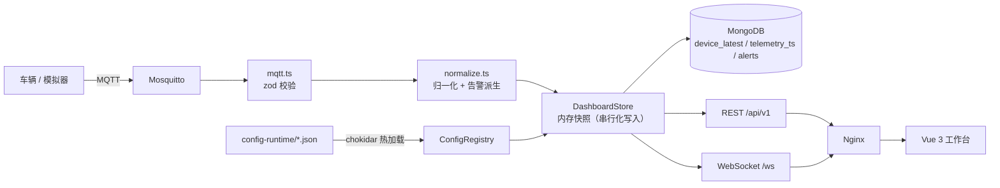

<!-- prettier-ignore-start -->
<div align="center">

# NavFleet · 智能车队监控平台

**面向 AGV / 巡检车 / 无人搬运车的实时运行态监控系统**

MQTT 接入 → 归一化 → 内存快照 → MongoDB 持久化 → REST + WebSocket → Vue 3 工作台

[](https://github.com/yezhoufan2005/NavFleet/actions/workflows/ci.yml)
[](https://github.com/yezhoufan2005/NavFleet/releases)
[](LICENSE)
[](package.json)

</div>
<!-- prettier-ignore-end -->

## 目录

- [这是什么](#这是什么)
- [核心能力](#核心能力)
- [系统架构](#系统架构)
- [快速开始](#快速开始)
- [演示数据](#演示数据)
- [项目结构](#项目结构)
- [配置](#配置)
- [API 与实时事件](#api-与实时事件)
- [MQTT 接入约定](#mqtt-接入约定)
- [生产部署](#生产部署)
- [可观测性与运维](#可观测性与运维)
- [开发与质量门禁](#开发与质量门禁)
- [文档索引](#文档索引)
- [路线与已知边界](#路线与已知边界)
- [许可](#许可)

## 这是什么

NavFleet 把设备接入、实时展示、历史追踪、地图资源和运行期配置收进一套可部署、可维护的
工程里。车辆只需向 MQTT broker 发布遥测，其余环节由后端完成：字段归一化、告警派生、
最新快照与时序落库、WebSocket 广播。前端是一个多页工作台，实时监控、历史回放、告警中心、
设置四个页面共享同一份状态与同一条 socket。

**定位是只读监控**：完整的登录与 RBAC（管理员 / 操作员 / 只读三角色），**不含控制下发，
也不做多租户**。这是有意的范围约束 —— 下发指令与监控是两种安全模型，混在一个进程里会让
两者都变脆。

**目标场景**是内网单实例部署：一台主机、Docker Compose、几十到数百台车。不做水平扩展与
跨实例 pub/sub。

## 核心能力

| 能力           | 说明                                                                              |
| -------------- | --------------------------------------------------------------------------------- |
| **MQTT 接入**  | 主题模板可配置；snake_case / camelCase 双写兼容；zod 校验后入库，被拒消息计入指标 |
| **状态归一化** | 增量上报自动与历史值合并，避免字段丢失；`lidar` 定位在 `fusion` 缺失时回退        |
| **告警派生**   | 提示 / 预警 / 告警报码 + 低电量、离线等规则；确认状态本地持久化                   |
| **三类地图**   | GPS（高德）、栅格 / 点云场景图、Lanelet2 路网（服务端解析 `.osm`）                |
| **历史回放**   | 基于 `telemetry_ts` 的时间轴回放，可变速、可拖拽进度                              |
| **鉴权**       | JWT access + refresh（refresh cookie 限定在 `/api/auth` 路径）、RBAC、限流        |
| **可观测性**   | 分级健康探针、Prometheus 指标、request-id 贯穿日志、预置 Grafana 面板与告警规则   |
| **运行期配置** | `config-runtime/*.json` 热加载，改车队 / 编队 / 场景无需重启或重建镜像            |
| **无障碍**     | WCAG 2.1 A + AA，axe-core 在 CI 中审计 5 个页面 × 明暗两套主题                    |

## 系统架构



边界很清楚：设备不知道前端和数据库的存在；前端只与后端说话，从不直连 broker；MongoDB
负责恢复与查询，不参与实时推送路径。详细分层见 [ARCHITECTURE.md](ARCHITECTURE.md)。

## 快速开始

### 环境要求

- Node.js **>= 20**（CI 在 20 / 22 上跑）
- Docker + Docker Compose（容器化部署）
- MongoDB 与 MQTT broker（compose 编排已包含；本地开发也可只跑其中之一）

仓库是 **npm workspaces 单体仓库**，只有一个根 lockfile。所有命令都从仓库根执行：

```bash
git clone https://github.com/yezhoufan2005/NavFleet.git
cd NavFleet
npm ci
```

### 方式一：Docker 一键起（推荐）

```bash
cp deploy/.env.example deploy/.env
```

编辑 `deploy/.env`，**至少**填好这四项 —— broker 已关闭匿名访问，口令留空时 compose 会
直接报错退出，而不是起一个谁都能连的 broker：

```dotenv
MQTT_SUBSCRIBER_PASSWORD=<后端连 broker 用>
MQTT_PUBLISHER_PASSWORD=<车辆/模拟器发布用>
JWT_SECRET=<openssl rand -hex 32>
ADMIN_PASSWORD=<初始管理员口令>
```

```bash
docker compose --env-file deploy/.env -f deploy/docker-compose.yml up -d --build
```

打开 <http://127.0.0.1:8080>，用 `ADMIN_USERNAME`（默认 `admin`）与 `ADMIN_PASSWORD` 登录。

### 方式二：本地开发

```bash
scripts/dev.sh
```

同时起后端（:3000）与前端（:5173）。若检测到 `127.0.0.1:1883` 上有 broker，会自动运行
演示发布器，走的是真实链路，只有数据是演示数据。`--no-mock` 关掉它，`--mock` 强制打开。

开发环境把 `ADMIN_PASSWORD` 留空时会创建 `admin / admin123` 并打印一条告警。
**生产环境留空则拒绝创建默认管理员** —— 与其偷偷放一个弱口令进去，不如启动失败。

手动分别启动、以及高德地图 Key 的配置，见 [deploy/docs/deployment.md](deploy/docs/deployment.md)。

## 演示数据

`config-runtime/` 里预置了 6 台车、3 个编队、5 个场景（栅格 SVG、CloudPoint 点云、
Lanelet2 路网各有实例）。演示发布器沿 lanelet 车道中心线行驶，而不是绕一个与路网无关的
矩形跑：

```bash
npm run mock:mqtt -- --count 4 --interval 1000
```

它会连到 `MQTT_URL`（默认 `mqtt://127.0.0.1:1883`），按 `config-runtime/vehicles.json`
里的车辆发布遥测。压测用 `backend/scripts/load-ingest.ts`。

## 项目结构

```text
NavFleet/
├─ backend/              # Node 20 + TypeScript + Express 5
│  ├─ src/
│  │  ├─ app.ts          # Express 组装：中间件顺序、鉴权闸门、双前缀挂载
│  │  ├─ index.ts        # 只负责组装运行时并启动
│  │  ├─ routes/         # ops / fleet / scenes / debug / docs
│  │  ├─ auth/           # 登录、JWT、RBAC 中间件
│  │  ├─ mqtt.ts         # broker 连接、订阅、校验后摄入
│  │  ├─ normalize.ts    # 遥测归一化 + 告警派生
│  │  ├─ store.ts        # 内存快照（写入串行化）
│  │  ├─ persistence.ts  # MongoDB 读写、索引、TTL
│  │  ├─ configRegistry.ts  # 运行期配置热加载
│  │  ├─ laneletOsm.ts   # Lanelet2 .osm 解析
│  │  └─ metrics.ts      # prom-client 注册表
│  └─ test/              # Vitest + supertest
├─ frontend/             # Vue 3 + Vite + Pinia + vue-router
│  ├─ src/
│  │  ├─ views/          # Dashboard / History / Alerts / Settings / NotFound
│  │  ├─ components/     # GpsMap / RosSceneMap / LoginForm 等
│  │  ├─ composables/    # useSvgViewport / useHistoryPlayback / useAuth 等
│  │  ├─ stores/fleet.ts # 状态与实时链路（单例）
│  │  └─ lib/            # 纯归一化函数，无 Vue 依赖
│  └─ test/              # Vitest + jsdom + @vue/test-utils
├─ packages/shared/      # @navfleet/shared —— 领域类型单一来源
├─ e2e/                  # Playwright + axe-core
├─ config-runtime/       # 运行期配置与地图资源（热加载，不进镜像）
├─ deploy/               # compose 编排、nginx、mosquitto、prometheus、grafana、文档、脚本
└─ scripts/              # dev.sh / smoke.sh
```

## 配置

后端所有环境变量都经 **zod 校验并 fail-fast** —— 配错一个数字就启动失败，而不是静默退回
默认值。共 34 个键，逐项说明见
[deploy/docs/config-reference.md](deploy/docs/config-reference.md)。

最需要注意的几个：

| 变量                    | 默认                             | 说明                                                            |
| ----------------------- | -------------------------------- | --------------------------------------------------------------- |
| `JWT_SECRET`            | 空                               | **生产必填**。留空则每次重启使所有会话失效                      |
| `ADMIN_PASSWORD`        | 空                               | 生产留空时拒绝创建默认管理员                                    |
| `AUTH_ENABLED`          | `true`                           | 关掉会让全部接口对匿名开放，仅用于本地调试                      |
| `DEBUG_INGEST_ENABLED`  | `false`                          | 开启 `POST /debug/ingest`，可注入任意状态；生产开启会 fail-fast |
| `MQTT_TOPIC_PATTERN`    | `/fleet/{deviceId}/vehicle_info` | 订阅主题由它推导，不是硬编码                                    |
| `TRUST_PROXY`           | `0`（compose 为 `1`）            | 反代跳数。配错会让整个部署共用一个限流额度                      |
| `CORS_ORIGINS`          | 空                               | 通配符在生产环境会 fail-fast                                    |
| `OFFLINE_AFTER_SECONDS` | `60`                             | 超时未上报即判离线                                              |

**运行期配置**（车队、车辆、编队、场景）走 `config-runtime/*.json`，由 chokidar 监听热
加载，改完即生效，无需重启或重建镜像。

## API 与实时事件

域接口同时挂在 **`/api/v1`（新客户端用这个）和裸 `/api`（保留兼容）** 下，两者完全等价 ——
挂两次而不是做 30x 跳转，是为了不丢方法与请求体。鉴权路径**故意不带版本**：refresh cookie
的作用域被限定在 `/api/auth`，加一个带版本的孪生路径会让这个限制失效。

| 方法   | 路径                                | 鉴权   | 说明                                |
| ------ | ----------------------------------- | ------ | ----------------------------------- |
| `GET`  | `/health`                           | 公开   | 存活探针                            |
| `GET`  | `/health/ready`                     | 公开   | 就绪探针（Mongo / MQTT 真实连通性） |
| `GET`  | `/metrics`                          | 公开*  | Prometheus 指标                     |
| `POST` | `/api/auth/login`                   | 公开   | 登录，签发 access + refresh         |
| `POST` | `/api/auth/refresh`                 | cookie | 续签                                |
| `POST` | `/api/auth/logout`                  | cookie | 注销                                |
| `GET`  | `/api/auth/me`                      | 需登录 | 当前用户与角色                      |
| `GET`  | `/api/v1/fleet/snapshot`            | 需登录 | 全量车队快照                        |
| `GET`  | `/api/v1/formations`                | 需登录 | 编队列表                            |
| `GET`  | `/api/v1/devices/:deviceId/history` | 需登录 | 历史遥测（分页、时间范围）          |
| `GET`  | `/api/v1/alerts`                    | 需登录 | 告警查询（严重度 / 设备 / 时间）    |
| `GET`  | `/api/v1/scenes`                    | 需登录 | 场景定义列表                        |
| `GET`  | `/api/v1/scenes/:sceneId`           | 需登录 | 单个场景                            |
| `GET`  | `/api/v1/scenes/:sceneId/overlay`   | 需登录 | Lanelet2 overlay（服务端解析结果）  |
| `POST` | `/api/v1/debug/ingest`              | admin  | 注入状态，**默认不挂载**            |
| `GET`  | `/openapi.json`                     | 需登录 | OpenAPI 3.1 文档                    |
| `GET`  | `/docs`                             | 需登录 | 同源自带的 Swagger UI               |

\* 边缘 nginx **不路由** `/metrics`：Prometheus 从容器网络内部抓取，公网/局域网碰不到它。

入参 schema 由 zod 验证器生成，**结构上无法与实现 drift**。

**WebSocket** `/ws`：升级握手只认 cookie 里的 token（不接受 query 参数，避免 token 进日志）。
事件为 `fleet.snapshot`（全量替换）与 `fleet.delta`（增量），另有应用层 ping/pong 心跳；
前端指数退避重连。

## MQTT 接入约定

默认订阅两个主题，均由 `MQTT_TOPIC_PATTERN` 推导：

```text
/fleet/{deviceId}/vehicle_info   遥测
/fleet/{deviceId}/status         在线状态
```

遥测 payload 同时接受 snake_case 与 camelCase，字段可缺省 —— 增量上报会与该车已有快照
合并，不会把未上报的字段清空。完整字段表见
[deploy/docs/config-reference.md](deploy/docs/config-reference.md)。

broker 侧强制账号与双向 ACL：发布账号只能写车辆主题，后端账号只能读。1883 端口只绑
`127.0.0.1`。

## 生产部署

基础编排之上是四个**叠加文件**，按需组合。用叠加而不是 compose `profiles:`，是因为
compose 会在应用 profile **之前**插值整个文件 —— profiled 服务上一个必填的 `${VAR:?}`
会让所有没启用该 profile 的部署 `up` 失败。

| 叠加                            | 作用                                                             |
| ------------------------------- | ---------------------------------------------------------------- |
| `docker-compose.yml`            | 基础：nginx / frontend / backend / mongo / mosquitto，三网段隔离 |
| `docker-compose.tls.yml`        | TLS 终止、HSTS、HTTP 308 跳转、`COOKIE_SECURE` 强制 true         |
| `docker-compose.monitoring.yml` | Prometheus + Grafana，预置数据源、14 个面板、9 条告警规则        |
| `docker-compose.backup.yml`     | 定时 mongodump，含恢复演练脚本                                   |

```bash
# 基础 + TLS + 监控
docker compose --env-file deploy/.env \
  -f deploy/docker-compose.yml \
  -f deploy/docker-compose.tls.yml \
  -f deploy/docker-compose.monitoring.yml up -d
```

网络分三段，让 web 层被拿下不等于数据库和 broker 也被拿下：`edge`（nginx ↔ frontend ↔
backend，唯一有主机端口的段）、`data`（backend ↔ mongo，`internal: true`）、`bus`
（backend ↔ mosquitto）。后端是唯一同时在三段上的服务；`edge` 上的东西根本寻址不到 mongo。

两个 nginx 都以非 root 运行。镜像随 release 发布到 GHCR。完整步骤、TLS 证书、反代配置见
[deploy/docs/deployment.md](deploy/docs/deployment.md)。

## 可观测性与运维

- **分级探针**：`/health` 存活；`/health/ready` 就绪（真实探测 Mongo 与 MQTT，不只看进程活着）
- **指标**：在线设备数、消息吞吐、被拒消息、告警数、WS 连接数、Mongo 写入延迟与缓冲长度、
  per-route 请求直方图（标签用路由模板，避免维度爆炸）
- **日志**：pino 结构化输出，request-id 贯穿日志与 500 响应体，口令 / token / URI 全部脱敏
- **告警规则**：9 条，全部写在真实暴露的指标上（25 处引用经机检零缺失）
- **备份**：`deploy/tools/mongo-backup.sh` / `mongo-restore.sh`，以及 `restore-drill.sh`
  真实恢复演练。见 [deploy/docs/backup-and-restore.md](deploy/docs/backup-and-restore.md)

## 开发与质量门禁

```bash
npm run lint          # eslint（含 e2e/）
npm run format:check  # prettier
npm run typecheck     # tsc / vue-tsc，三个 workspace + e2e
npm test              # 单元 + 集成
npm run e2e           # Playwright（自带后端与前端，不需要 Mongo/MQTT/docker）
npm run build         # shared → backend → frontend
```

| 门禁     | 数量    | 说明                                                                        |
| -------- | ------- | --------------------------------------------------------------------------- |
| 后端测试 | **279** | Vitest + supertest：路由、鉴权、校验、404、错误中间件、WS、配置注册表       |
| 前端测试 | **161** | Vitest + jsdom：store、实时链路、视图交互、composable                       |
| E2E      | **17**  | Playwright：登录、仪表盘、地图、告警、历史回放、404，含 axe-core 无障碍审计 |
| 覆盖率   | ratchet | 前后端各有阈值，只许上调，不许为了让红变绿而下调                            |

CI 在 Node 20 / 22 上跑全部门禁，E2E 单独一个 job。提交前 husky + lint-staged 会对暂存
文件跑 prettier；完整门禁仍在 CI。约定式提交 + release-please 自动出 CHANGELOG 与 GHCR
镜像。贡献流程见 [CONTRIBUTING.md](CONTRIBUTING.md)。

## 文档索引

| 文档                                                                   | 内容                                        |
| ---------------------------------------------------------------------- | ------------------------------------------- |
| [ARCHITECTURE.md](ARCHITECTURE.md)                                     | 分层、模块职责、数据流、前后端各文件的作用  |
| [deploy/docs/deployment.md](deploy/docs/deployment.md)                 | 部署步骤、TLS、反代、镜像发布               |
| [deploy/docs/config-reference.md](deploy/docs/config-reference.md)     | 34 个环境变量 + 运行期 JSON 全字段          |
| [deploy/docs/backup-and-restore.md](deploy/docs/backup-and-restore.md) | 备份、恢复、演练                            |
| [CONTRIBUTING.md](CONTRIBUTING.md)                                     | 分支、提交规范、本地门禁                    |
| [ROADMAP.md](ROADMAP.md)                                               | 当前路线图（v1.0.0 之后的计划与决策）       |
| [docs/roadmap-archive.md](docs/roadmap-archive.md)                     | v1.0.0 之前的阶段记录（含每阶段修掉的缺陷） |
| [CHANGELOG.md](CHANGELOG.md)                                           | 版本变更（release-please 生成）             |

## 路线与已知边界

1.0 有意不包含的东西，以及已知的限制：

- **不做控制下发、不做多租户** —— 范围约束，不是待办。
- **不做水平扩展**：状态在单进程内存里，多实例需要引入跨实例 pub/sub，与「内网单实例」的
  定位不符。
- **11 个 `.vue` 仍是普通 `<script setup>`**，未加 `lang="ts"`。`src/**` 的 `.ts` 已全部
  strict 且无显式 `any`，SFC 的渐进迁移推到 1.1。
- **MQTT 摄入无背压**：broker 灌得足够快时，摄入队列会无限增长。
- **`prom-client` 上游已 deprecated**，待 `@prometheus-io/client` 有采用度后替换。
- **Lanelet2 解析不过滤 `delete="true"`**：示例网络 88 条 lanelet 中 46 条带该标记，目前
  仍会绘制。
- **axe 的 `incomplete` 桶未断言**：半透明与渐变表面会落入该桶而不产生违规，这类对比度
  问题仍需人工审阅。

## 许可

[MIT](LICENSE) © 2026 yezhoufan
