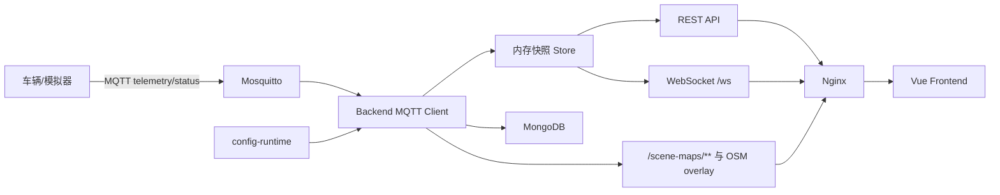

# 多车监控平台

该项目是一个面向 AGV/智能车队的实时监控项目。系统通过 MQTT 接收车辆遥测和在线状态，后端统一归一化数据并写入 MongoDB，同时通过 REST API 和 WebSocket 推送给 Vue 前端，用于展示车辆列表、编队、GPS 地图、场景地图、点云地图、Lanelet2 路网和告警信息。

当前交付包已经包含可直接运行的 Docker Compose 编排：

- `nginx`：统一 Web 入口，代理前端、后端接口、WebSocket 和地图资源。
- `frontend`：Vue 3 + Vite 构建后的静态页面。
- `backend`：Node.js 20 + TypeScript 后端服务。
- `mongo`：遥测历史、最新快照和告警存储。
- `mosquitto`：本地 MQTT Broker，便于完整闭环运行和验收。

## 1. 快速启动

### 1.1 Docker 一键启动

```bash
cd /path/to/mqtt
cp deploy/.env.example deploy/.env
docker compose --env-file deploy/.env -f deploy/docker-compose.yml up -d --build
```

默认访问地址：

```text
http://127.0.0.1:8080
```

默认 MQTT 接入地址：

```text
mqtt://127.0.0.1:1883
```

检查服务：

```bash
curl http://127.0.0.1:8080/health
curl http://127.0.0.1:8080/api/scenes
curl http://127.0.0.1:8080/api/fleet/snapshot
```

### 1.2 发送模拟车辆数据

Docker 启动后，可以在本机运行模拟发布脚本：

```bash
cd backend
npm install
npm run mock:mqtt -- --broker mqtt://127.0.0.1:1883 --device-prefix agv --count 4 --interval 1000
```

模拟脚本会向 `/fleet/{deviceId}/vehicle_info` 和 `/fleet/{deviceId}/status` 发布车辆数据。页面收到数据后会显示车辆、告警和地图位置。

## 2. 项目目录

```text
mqtt/
├─ backend/                 # Node.js + TypeScript 后端
│  ├─ src/
│  │  ├─ index.ts           # Express / WebSocket / MQTT 入口
│  │  ├─ config.ts          # 环境变量与运行路径
│  │  ├─ configRegistry.ts  # 运行期配置加载、校验和热更新
│  │  ├─ normalize.ts       # MQTT/API payload 归一化
│  │  ├─ store.ts           # 内存快照、告警、编队和广播
│  │  ├─ persistence.ts     # MongoDB 持久化
│  │  ├─ laneletOsm.ts      # Lanelet2 OSM 解析
│  │  └─ types.ts           # 类型定义
│  ├─ scripts/mock-mqtt.ts  # 模拟 MQTT 发布脚本
│  └─ Dockerfile
├─ frontend/                # Vue 3 + Vite 前端
│  ├─ src/
│  │  ├─ App.vue
│  │  ├─ components/        # GPS 地图、ROS/场景地图
│  │  ├─ composables/       # 页面状态和实时连接
│  │  ├─ utils/             # 高德地图、坐标、点云工具
│  │  └─ assets/
│  └─ Dockerfile
├─ config-runtime/          # 运行期配置和地图资源
│  ├─ fleet.json
│  ├─ vehicles.json
│  ├─ formations.json
│  ├─ scenes.json
│  └─ scene-maps/
├─ deploy/
│  ├─ docker-compose.yml
│  ├─ .env.example
│  ├─ nginx/default.conf
│  ├─ mosquitto/mosquitto.conf
│  ├─ docs/
│  └─ tools/
└─ ARCHITECTURE.md
```

## 3. 系统架构



核心原则：

- 前端不直连 MQTT，只访问后端接口和 WebSocket。
- 后端是车辆配置、编队配置、场景配置的唯一运行时来源。
- `config-runtime/` 是可挂载、可热更新的运行期配置目录，修改配置无需重建镜像。
- MongoDB 保存最新快照、遥测历史和告警记录；系统实时展示主要依赖内存快照和 WebSocket。

更详细的架构说明见 [ARCHITECTURE.md](./ARCHITECTURE.md)。

## 4. 本地开发

### 4.1 环境要求

- Node.js 20+
- npm
- MongoDB，可用 Docker 或本机服务
- MQTT Broker，可用本项目 Compose 内置 Mosquitto

### 4.2 后端

复制环境变量示例：

```bash
cd backend
cp .env.example .env
```

Windows 本机建议把 `CONFIG_ROOT_PATH` 改成绝对路径，例如：

```env
CONFIG_ROOT_PATH=C:\Users\Frspble\Desktop\mqtt\config-runtime
```

启动：

```bash
npm install
npm run dev
```

后端默认监听：

```text
http://127.0.0.1:3000
```

### 4.3 前端

```bash
cd frontend
npm install
npm run dev
```

前端默认监听：

```text
http://127.0.0.1:5173
```

开发环境下，Vite 会把这些路径代理到后端：

- `/api`
- `/ws`
- `/health`
- `/scene-maps`

### 4.4 高德地图 Key

GPS 地图依赖高德地图 JS API。前端开发时可在 `frontend/.env` 配置：

```env
VITE_AMAP_KEY=高德Key
VITE_AMAP_SECURITY_JS_CODE=高德安全密钥
```

Docker 部署时在 `deploy/.env` 中填写同名变量后重新构建前端镜像。

## 5. Docker 部署

推荐部署入口是：

```bash
docker compose --env-file deploy/.env -f deploy/docker-compose.yml up -d --build
```

常用命令：

```bash
docker compose --env-file deploy/.env -f deploy/docker-compose.yml ps
docker compose --env-file deploy/.env -f deploy/docker-compose.yml logs -f backend
docker compose --env-file deploy/.env -f deploy/docker-compose.yml down
```

默认端口：

| 服务 | 容器内端口 | 宿主机端口 | 说明 |
| --- | --- | --- | --- |
| Nginx | `80` | `8080` | Web 入口 |
| Mosquitto | `1883` | `1883` | MQTT 接入 |
| Backend | `3000` | 不直接暴露 | 通过 Nginx 代理 |
| MongoDB | `27017` | 不直接暴露 | Compose 内部访问 |

如果要使用 80 端口作为正式访问入口，把 `deploy/.env` 中的 `HTTP_HOST_PORT` 改为：

```env
HTTP_HOST_PORT=80
```

完整部署说明见 [deploy/docs/deployment.md](./deploy/docs/deployment.md)。

## 6. 运行期配置

后端从 `CONFIG_ROOT_PATH` 读取运行期配置。Docker 中默认挂载为：

```text
宿主机: ./config-runtime
容器内: /runtime-config
```

目录结构：

```text
config-runtime/
├─ fleet.json       # 车队默认配置
├─ vehicles.json    # 车辆配置数组
├─ formations.json  # 编队配置数组
├─ scenes.json      # 场景配置数组
└─ scene-maps/      # 地图、点云、OSM、元数据资源
```

热更新规则：

- 修改 `fleet.json`、`vehicles.json`、`formations.json`、`scenes.json`：后端自动热加载，并通过 WebSocket 推送新快照。
- 修改 `scene-maps/**/*.osm`：后端自动重新解析 Lanelet2 路网。
- 修改普通图片、点云、元数据文件：刷新浏览器即可。

配置字段详见 [deploy/docs/config-reference.md](./deploy/docs/config-reference.md)。

## 7. API 和实时事件

主要 REST API：

- `GET /health`
- `GET /api/fleet/snapshot`
- `GET /api/formations`
- `GET /api/devices/:deviceId/history?from=&to=&limit=`
- `GET /api/alerts?severity=&deviceId=&status=`
- `GET /api/scenes`
- `GET /api/scenes/:sceneId`
- `GET /api/scenes/:sceneId/overlay`
- `POST /api/debug/ingest`
- `GET /scene-maps/**`

WebSocket：

- 路径：`/ws`
- 事件：`fleet.snapshot`、`fleet.delta`、`alert.created`、`alert.cleared`、`device.online`、`device.offline`

## 8. MQTT 接入约定

后端当前订阅：

```text
/fleet/+/vehicle_info
/fleet/+/status
```

遥测主题：

```text
/fleet/{deviceId}/vehicle_info
```

在线状态主题：

```text
/fleet/{deviceId}/status
```

典型遥测 payload：

```json
{
  "stamp": 1712472000000,
  "scene_id": "kangcheng-airy",
  "fusion_loc": { "x": 18.6, "y": 63.1, "yaw": 0.42 },
  "lidar_loc": { "x": 18.2, "y": 62.8, "yaw": 0.39 },
  "vehicle_info": {
    "control_mode": 1,
    "gear": 1,
    "speed": 2.32,
    "omega": 0.11,
    "soc": 78.4
  },
  "task_status": 1,
  "platform_task_status": 2,
  "info_code": { "code": 0, "info": "", "stamp": 1712472000000 },
  "warning_code": { "code": 0, "info": "", "stamp": 1712472000000 },
  "error_code": { "code": 0, "info": "", "stamp": 1712472000000 },
  "speed_limit": {
    "limit": 2.5,
    "slowdown_time": 0,
    "stamp": 1712472000000,
    "module_name": "planner"
  },
  "gps": { "lat": 31.2316, "lng": 121.4722, "heading": 72 }
}
```

状态 payload 支持：

```json
{ "online": true, "ts": 1712472000000 }
```

也支持字符串形式，例如 `online`、`offline`、`true`、`false`。
